# Experimental API Framework - Diagrams and Workflows

This document contains visual diagrams to help understand the experimental API framework architecture and workflows.

## Table of Contents
1. [Architecture Overview](#architecture-overview)
2. [Permission Flow](#permission-flow)
3. [API Call Sequence](#api-call-sequence)
4. [Installation Workflow](#installation-workflow)
5. [Settings Enforcement](#settings-enforcement)
6. [Notification System](#notification-system)
7. [Feature Lifecycle](#feature-lifecycle)

---

## Architecture Overview


---

## Permission Flow


---

## API Call Sequence


---

## Installation Workflow

```mermaid
flowchart TD
    START([User uploads/installs app])
    
    PARSE[Parse app.json]
    CHECK_EXP{Has experimental<br/>features?}
    
    SHOW_WARNING[Show warning modal]
    WARNING_CONTENT["⚠️ Experimental Features Warning<br/><br/>This app uses experimental features:<br/>- feature-alpha (Alpha)<br/>- feature-beta (Beta)<br/><br/>⚠️ Important:<br/>• May break in future updates<br/>• May be removed without notice<br/>• Not covered by standard support<br/><br/>Continue installation?"]
    
    USER_CHOICE{User accepts<br/>risks?}
    
    VALIDATE_PERMS[Validate permissions]
    CHECK_SETTINGS{Experimental features<br/>enabled in settings?}
    
    CHECK_ALLOWED{Features in<br/>allowed list?}
    
    INSTALL[Install app]
    MARK_EXPERIMENTAL[Mark app as using experimental features]
    NOTIFY_ADMIN[Notify admins]
    ADD_BADGE[Add experimental badge in UI]
    LOG_INSTALL[Log installation with experimental flag]
    
    SUCCESS([Installation complete])
    
    CANCEL[Cancel installation]
    ERROR_DISABLED[Show error: Experimental features disabled]
    ERROR_NOT_ALLOWED[Show error: Some features not allowed]
    
    FAIL([Installation failed])
    
    START --> PARSE
    PARSE --> CHECK_EXP
    
    CHECK_EXP -->|No| VALIDATE_PERMS
    CHECK_EXP -->|Yes| SHOW_WARNING
    
    SHOW_WARNING --> WARNING_CONTENT
    WARNING_CONTENT --> USER_CHOICE
    
    USER_CHOICE -->|No| CANCEL
    USER_CHOICE -->|Yes| VALIDATE_PERMS
    
    VALIDATE_PERMS --> CHECK_SETTINGS
    
    CHECK_SETTINGS -->|No| ERROR_DISABLED
    CHECK_SETTINGS -->|Yes| CHECK_ALLOWED
    
    CHECK_ALLOWED -->|No| ERROR_NOT_ALLOWED
    CHECK_ALLOWED -->|Yes| INSTALL
    
    INSTALL --> MARK_EXPERIMENTAL
    MARK_EXPERIMENTAL --> NOTIFY_ADMIN
    NOTIFY_ADMIN --> ADD_BADGE
    ADD_BADGE --> LOG_INSTALL
    LOG_INSTALL --> SUCCESS
    
    CANCEL --> FAIL
    ERROR_DISABLED --> FAIL
    ERROR_NOT_ALLOWED --> FAIL
    
    style START fill:#90EE90
    style SUCCESS fill:#90EE90
    style FAIL fill:#FFB6C6
    style WARNING_CONTENT fill:#FFE4B5
    style SHOW_WARNING fill:#FFE4B5
    style ERROR_DISABLED fill:#FFB6C6
    style ERROR_NOT_ALLOWED fill:#FFB6C6
    style INSTALL fill:#87CEEB
```



---

## Settings Enforcement


---

## Notification System

```mermaid
graph TB
    subgraph "Trigger Events"
        INSTALL[App Installation]
        UPDATE[App Update]
        FIRST_USE[First API Use]
        DEPRECATE[Feature Deprecated]
        REMOVE[Feature Removed]
    end
    
    subgraph "Notification Router"
        ROUTER{Notification Type}
    end
    
    subgraph "Notification Channels"
        MODAL[Modal Dialog]
        BADGE[UI Badge/Icon]
        BANNER[Admin Banner]
        EMAIL[Email Alert]
        LOG[System Log]
        WEBHOOK[Webhook]
    end
    
    subgraph "Notification Content"
        INSTALL_MSG["App X uses experimental features:<br/>• feature-alpha (Alpha)<br/>• feature-beta (Beta)"]
        
        DEPRECATE_MSG["⚠️ Deprecation Warning<br/><br/>Feature 'feature-alpha' is deprecated<br/>and will be removed in version X.X.X<br/><br/>Affected apps:<br/>• App A<br/>• App B<br/><br/>Migration guide: [link]"]
        
        REMOVE_MSG["🚨 Breaking Change<br/><br/>Feature 'feature-alpha' has been removed<br/><br/>Affected apps will no longer function:<br/>• App A<br/>• App B<br/><br/>Action required: Update or uninstall"]
    end
    
    INSTALL --> ROUTER
    UPDATE --> ROUTER
    FIRST_USE --> ROUTER
    DEPRECATE --> ROUTER
    REMOVE --> ROUTER
    
    ROUTER -->|Install/Update| MODAL
    ROUTER -->|Install/Update| BADGE
    ROUTER -->|First Use| LOG
    ROUTER -->|Deprecate| BANNER
    ROUTER -->|Deprecate| EMAIL
    ROUTER -->|Remove| BANNER
    ROUTER -->|Remove| EMAIL
    ROUTER -->|Remove| WEBHOOK
    
    MODAL -.-> INSTALL_MSG
    BANNER -.-> DEPRECATE_MSG
    EMAIL -.-> REMOVE_MSG
    
    style INSTALL fill:#87CEEB
    style DEPRECATE fill:#FFE4B5
    style REMOVE fill:#FFB6C6
    style MODAL fill:#DDA0DD
    style BADGE fill:#DDA0DD
    style BANNER fill:#DDA0DD
    style EMAIL fill:#DDA0DD
```



---

## Feature Lifecycle


---

## App Usage Badge System

```mermaid
graph LR
    subgraph "App Card in Admin UI"
        APP_ICON[App Icon]
        APP_NAME[App Name]
        APP_VERSION[Version 1.0.0]
        BADGES[Badges Area]
    end
    
    subgraph "Badge Logic"
        CHECK{Uses experimental<br/>features?}
        LEVEL{Most severe<br/>feature status?}
    end
    
    subgraph "Badge Variants"
        NONE[No Badge]
        ALPHA[🔬 Alpha Features]
        BETA[⚠️ Beta Features]
        DEPRECATED[⚠️ Deprecated Features]
    end
    
    subgraph "Tooltip Details"
        TOOLTIP["Experimental Features Used:<br/><br/>🔬 feature-alpha (Alpha)<br/>  Introduced: v1.56.0<br/>  Status: Unstable<br/><br/>⚠️ feature-beta (Beta)<br/>  Introduced: v1.57.0<br/>  Status: Mostly stable<br/><br/>⚠️ These features may change<br/>or be removed without notice."]
    end
    
    BADGES --> CHECK
    CHECK -->|No| NONE
    CHECK -->|Yes| LEVEL
    
    LEVEL -->|Has Alpha| ALPHA
    LEVEL -->|Has Beta only| BETA
    LEVEL -->|Has Deprecated| DEPRECATED
    
    ALPHA -.hover.-> TOOLTIP
    BETA -.hover.-> TOOLTIP
    DEPRECATED -.hover.-> TOOLTIP
    
    APP_ICON --- APP_NAME
    APP_NAME --- APP_VERSION
    APP_VERSION --- BADGES
    
    style ALPHA fill:#ff9999
    style BETA fill:#ffcc99
    style DEPRECATED fill:#ffeb99
    style TOOLTIP fill:#f0f0f0
```



---

## Migration Path Example

```mermaid
flowchart TD
    subgraph "Version 1.56.0"
        V156_NEW[New Experimental Feature:<br/>experimental.advancedSearch]
        V156_STATUS[Status: Alpha]
    end
    
    subgraph "Version 1.58.0"
        V158_IMPROVE[Feature Improvements:<br/>• Performance optimizations<br/>• Breaking API changes<br/>• Bug fixes]
        V158_STATUS[Status: Alpha]
    end
    
    subgraph "Version 1.60.0"
        V160_STABLE[Feature Stabilized:<br/>• API frozen<br/>• Full tests<br/>• Documentation]
        V160_STATUS[Status: Beta]
    end
    
    subgraph "Version 1.62.0"
        V162_GRAD[Feature Graduated:<br/>• Moved to SearchBridge<br/>• Standard permissions<br/>• Long-term support]
        V162_STATUS[Status: Stable]
        V162_OLD[Legacy experimental API:<br/>Still works but deprecated]
    end
    
    subgraph "Version 1.64.0"
        V164_WARN[Deprecation Warnings:<br/>• Console warnings<br/>• Admin notifications<br/>• Migration guide]
        V164_STATUS[Status: Deprecated]
    end
    
    subgraph "Version 1.66.0"
        V166_REMOVE[Experimental API Removed:<br/>• Returns error<br/>• Apps must use stable API]
        V166_STATUS[Status: Removed]
    end
    
    V156_NEW --> V156_STATUS
    V156_STATUS -->|2 versions| V158_IMPROVE
    V158_IMPROVE --> V158_STATUS
    V158_STATUS -->|2 versions| V160_STABLE
    V160_STABLE --> V160_STATUS
    V160_STATUS -->|2 versions| V162_GRAD
    V162_GRAD --> V162_STATUS
    V162_GRAD --> V162_OLD
    V162_OLD -->|2 versions| V164_WARN
    V164_WARN --> V164_STATUS
    V164_STATUS -->|2 versions| V166_REMOVE
    V166_REMOVE --> V166_STATUS
    
    style V156_NEW fill:#ff9999
    style V158_IMPROVE fill:#ff9999
    style V160_STABLE fill:#ffcc99
    style V162_GRAD fill:#90EE90
    style V164_WARN fill:#ffeb99
    style V166_REMOVE fill:#FFB6C6
    
    note1["⚠️ Breaking changes<br/>allowed in Alpha"]
    note2["🎯 Minimum 4 versions<br/>from Alpha to Removal"]
    
    V158_STATUS -.-> note1
    V166_STATUS -.-> note2
```



---

## Error Handling Flow

```mermaid
flowchart TD
    ERROR{Error Type}
    
    DISABLED[ExperimentalFeatureDisabledError]
    PERMISSION[PermissionDeniedError]
    DEPRECATED[FeatureDeprecatedError]
    REMOVED[FeatureRemovedError]
    RUNTIME[RuntimeError]
    
    ERROR --> DISABLED
    ERROR --> PERMISSION
    ERROR --> DEPRECATED
    ERROR --> REMOVED
    ERROR --> RUNTIME
    
    subgraph "Response - ExperimentalFeatureDisabledError"
        DIS_LOG[Log to app logs]
        DIS_RETURN[Return error to app:<br/>• Error code: 403<br/>• Message: 'Experimental features disabled'<br/>• Hint: 'Contact admin to enable']
        DIS_UI[Show in admin UI:<br/>'App requires experimental features']
    end
    
    subgraph "Response - PermissionDeniedError"
        PERM_LOG[Log to app logs]
        PERM_RETURN[Return error to app:<br/>• Error code: 403<br/>• Message: 'Missing permission'<br/>• Required: 'experimental.feature-X']
        PERM_UI[Show in install UI:<br/>'Grant required permissions']
    end
    
    subgraph "Response - FeatureDeprecatedError"
        DEP_LOG[Log warning]
        DEP_RETURN[Execute but log warning:<br/>• Warning: 'Feature deprecated'<br/>• Removal version: 'X.X.X'<br/>• Migration: [link]]
        DEP_NOTIFY[Notify app developer<br/>via admin panel]
    end
    
    subgraph "Response - FeatureRemovedError"
        REM_LOG[Log error]
        REM_RETURN[Return error to app:<br/>• Error code: 410<br/>• Message: 'Feature removed'<br/>• Alternative: [link]]
        REM_DISABLE[Optionally disable app<br/>if critical]
    end
    
    DISABLED --> DIS_LOG --> DIS_RETURN --> DIS_UI
    PERMISSION --> PERM_LOG --> PERM_RETURN --> PERM_UI
    DEPRECATED --> DEP_LOG --> DEP_RETURN --> DEP_NOTIFY
    REMOVED --> REM_LOG --> REM_RETURN --> REM_DISABLE
    
    style DISABLED fill:#FFB6C6
    style PERMISSION fill:#FFB6C6
    style DEPRECATED fill:#FFE4B5
    style REMOVED fill:#FFB6C6
    style RUNTIME fill:#FFB6C6
```

---

## Database Schema


---

## Summary

These diagrams illustrate:

1. **Architecture**: Overall structure of the experimental API framework
2. **Permission Flow**: How permissions are checked at runtime
3. **API Call Sequence**: Detailed interaction between components
4. **Installation Workflow**: How apps with experimental features are installed
5. **Settings Enforcement**: How system settings control experimental features
6. **Notification System**: How users are notified about experimental feature usage
7. **Feature Lifecycle**: Complete lifecycle from proposal to removal
8. **Badge System**: How experimental features are visually indicated
9. **Migration Path**: Example of how a feature graduates from experimental to stable
10. **Error Handling**: How different error scenarios are handled
11. **Database Schema**: Data model for tracking experimental feature usage

All diagrams use Mermaid format and can be rendered in any Markdown viewer that supports Mermaid diagrams (GitHub, GitLab, VS Code with plugins, etc.).

---

**Document Version**: 1.0  
**Last Updated**: 2025-10-13  
**Related**: EXPERIMENTAL_API_FRAMEWORK_PLAN.md
