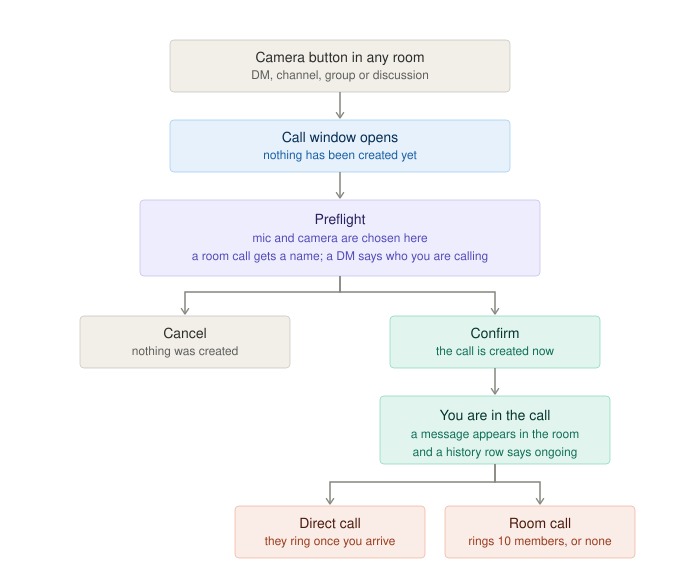
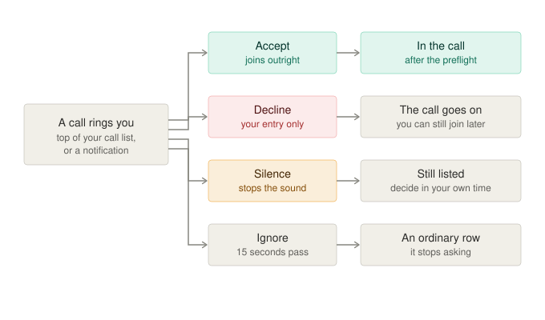
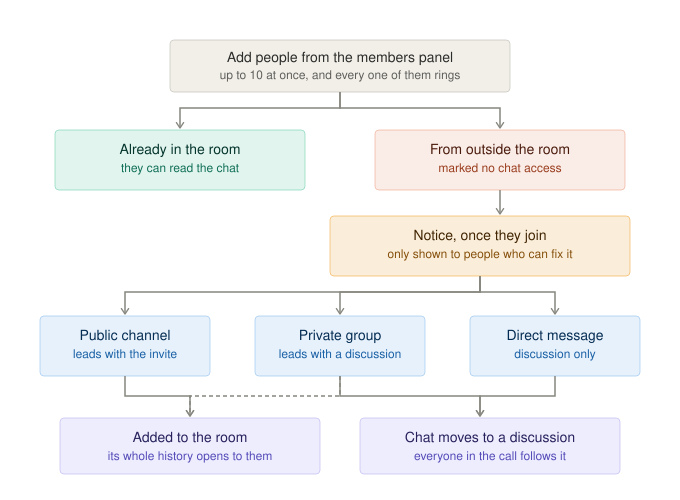
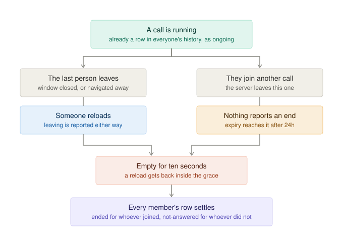

# Video Conference Persistent Chat

## Overview

Persistent chat gives a video conference a Rocket.Chat room that lives alongside the call, so the conversation survives after the call ends. Instead of handing the user off to the provider's own page, joining a conference opens an in-product page at `/conference/:id` — the provider's call in an iframe, a control bar along the bottom, and the conference's chat in a collapsible panel docked to the inline end.

### The setting

Everything below is behind one EE setting, **`VideoConf_Conference_Window_Enabled`** (module
`videoconference-enterprise`), **off by default**. With it off the client behaves exactly as it did before any of
this existed: the provider's own page opens in a tab, an incoming call is a popup over the screen, a direct call
rings from the room and waits there, and nothing new is asked of the server. This document says *"with the call
window"* / *"without the call window"* for the two states.

It is deliberately independent of `VideoConf_Enable_Persistent_Chat`, which keeps meaning only what it has always
meant: a discussion or thread per call, created server-side. A workspace already running persistent chat sees no
change until the call window is turned on; and the call window works with persistent chat off, where its chat
panel simply shows the room the call was started in.

The chat can run in one of two modes, controlled by `VideoConf_Persistent_Chat_Mode`:

- **Thread** (default): the chat panel renders a thread started from the conference message in the original channel. No discussion room is created. Access is based on the parent channel — anyone who can read the channel can participate in the thread.
- **Main room** (`main_room`): the chat panel shows the channel itself. A separate discussion room is created off the parent channel when needed (requires `Discussion_enabled`). The chat room is resolved from `discussionRid` when the discussion exists, otherwise the conference's `rid`. A conference's `rid` never changes; only `discussionRid` moves.

The discussion/thread itself is gated by the EE setting `VideoConf_Enable_Persistent_Chat` (same module), which
is what it gated before this feature and all it gates now.

So the mode alone never says where a call's chat lives — it only says which of the two the workspace *wants*. It
takes three answers, and the call window has to read all three the way the server does, since the mode's
registered default is `thread` and reading it on its own puts the panel over a thread the server never made:

| | thread | main room |
| --- | --- | --- |
| `VideoConf_Enable_Persistent_Chat` off | the room | the room |
| provider without the `persistentChat` capability | the room | the room |
| both, and the mode agrees | thread off the call message | the discussion, once it exists |

`autoFollowCallThread` and `maybeCreateDiscussion` are where the server applies exactly that;
`useConferenceEmbedded` reads `capabilities.persistentChat` off the conference it already fetched.

## The flows at a glance

Four diagrams covering a call's life. They describe the feature with the call window **on**; with it off none of it
applies — see [Opening a Conference](#opening-a-conference) for what happens instead.

| | |
|---|---|
| [Starting a call](./starting-a-call.svg) | the camera button, the preflight, and what confirming creates |
| [Being called](./being-called.svg) | accept, decline, silence or ignore — and where each leaves the call |
| [Adding people and chat access](./adding-people-and-chat-access.svg) | who can read the chat, and the two ways to fix it |
| [Ending a call](./ending-a-call.svg) | the four ways a call stops, and what the history records |









## Opening a Conference

**Placing a call** (`startCall`) with the call window on posts *nothing*. It opens the window at
`/conference/new?rid=…`, and the conference is created there, by the [preflight](#the-preflight-screen). Without
the call window it goes through `VideoConfManager.startCall` as it always has, which for a direct call means
ringing the callee and waiting in the room — no window opens until they answer.

The room's call button goes straight there. It used to open a popup to confirm and set devices first, which the
preflight now does with the user able to see what they are joining — two confirmations for one call. That popup
remains the only place to set devices when there is no preflight, so it is still what a workspace without the
call window gets.

**Joining one that exists** (`joinCall`) emits `call/join`:

- **Call window enabled** — `{ callId }`, and again nothing is posted: the conference page joins for itself
  once its preflight is confirmed.
- **Disabled** — `POST /v1/video-conference.join` first, then `{ url, callId, providerName }`, the pre-existing
  behavior.

`VideoConfProvider` handles `call/join` by opening `/conference/:id` (absolute URL) with the call window on, or
the provider URL without it, and `useVideoConfOpenCall` opens the window. On desktop,
`openInternalVideoChatWindow` takes over.

### The window opens on the click

Every call type opens its window **on the click that asked for it**, inside the browser's user-activation window.
`window.open` from anything later — a stream event, a timer — is something the browser is entitled to refuse, and
`VideoConfBlockModal` then has to ask the user to click again for a window they already asked for. A direct call
used to be the exception: it rang the callee and kept the caller waiting in the room, opening the window only once
the answer arrived, which is exactly the refusable case.

So the wait moves into the call window, and the room stops showing an outgoing popup for a call the user is
already sitting in. Telling the caller that nobody picked up is [deferred](#deferred-to-follow-ups); for now the
members panel shows the other side still ringing.

### When the callee is rung

Creating a direct call is not asking anyone to answer it. The caller lands on the [preflight](#the-preflight-screen)
first, so the ring waits for them to actually enter the call: `addUserToCall` rings the other side when the
**caller** arrives, and only members who have never been rung — a rejoin rings nobody. A second attempt is what
the members panel's per-member *ring* is for.

Being rung into a call whose caller is still choosing a camera means answering to an empty room, which is what
this avoids. The screen says as much before it happens ("Alice will be notified when you start the call") and the
button is the call itself rather than a join.

Without the call window there is no preflight to wait for, so nothing changes: the caller's own client rings the
callee from the room, on the 1:1 handshake it always used. A server-originated `ring` — which the server has
always broadcast for group calls — is ignored by the client then, exactly as it was before this work, so a group
call does not start ringing a whole channel.

### How the call window is opened

A call opens as a **popout** — a dedicated window sized to 1280×800 (capped to the available screen) and centred — mirroring the desktop app's dedicated video window and keeping the call visible while the user works in the main app. If the popout is refused, it falls back to an ordinary **tab**; some browsers and extensions block popup-shaped windows while still allowing a plain one. Only if both are blocked does `VideoConfBlockModal` ask the user to allow it.

`noopener` is deliberately **never** in the features string: it makes `window.open` return `null`, which is indistinguishable from a blocked popup, and the opener link is what lets the main app notice the call window closing (see [The window that opened the call watches it](#the-window-that-opened-the-call-watches-it)).

Same-origin (in-product) conferences share a named window, `rocketchat-conference`, so repeated joins reuse it instead of stacking duplicates:

| State of the shared window | Behaviour |
|---|---|
| already showing this conference | focused without reloading (empty URL) and **without features**, so a window the user has arranged is not resized or recentred |
| showing a different conference | navigated to the new one |
| closed, or never opened | opened fresh as a popout |

Whether it is showing this conference is decided by reading the window's actual `location.pathname`, not the URL we last passed — those differ in string form between the start and join paths.

External provider URLs get their own popout each time, unnamed.

Without the call window none of this applies: `window.open(url)` with no name and no features, a plain tab, and
`VideoConfBlockModal` if that returns `null` — the behaviour that has always been there.

## The preflight screen

Opening the call window and being in the call are two different things, and the window opens first. What it shows
until the user says otherwise is `ConferencePreflight`: what the call is called, the devices they will arrive
with, and — for whoever started a group call — a field to name it.

### Nothing exists until it is confirmed

Clicking *call* in a room used to create the conference: a message in the room, a ring, a call in everyone's
history — for a call the user might still walk away from. Now the click only opens the window, at
`/conference/new?rid=…`, and `ConferenceStartPage` runs the preflight against the *room*: the name to offer comes
from the reader's own subscription (which is what names a DM after the other person), the devices from
`video-conference.capabilities`. Confirming posts `start` and then `join`, hands the join result to the conference
page through the query cache, and replaces the URL with `/conference/:callId` — so a reload lands on the call
rather than starting a second one, and the page doesn't ask the same questions again.

**Cancel** sits beside the confirm button and closes the window. On the start screen that leaves no trace at all,
because nothing was created; on a call that already exists it reports leaving first.

### Why the join waits

The window has to open on the click, as above. The *join*, though, is what turns mic and camera into the
provider's URL and what marks the user as present in the call — so it waits here instead:

- `VideoConfManager.joinCall` posts nothing when the call window is on — it only opens the window. Posting there
  would throw away the URL it returns and count the user as present in a call they have not chosen to enter yet.
- `useConferenceEmbedded` joins as a mutation, from the preflight's confirmation, carrying the preferences it was
  given.

Devices are configured **only** here. The room's start-call and incoming-call popups used to ask, seconds before
a window opened, and then the conference page joined with a hardcoded `{ mic: true, cam: false }` regardless —
so the popups now leave the question alone whenever the call window is on. With it off there is no preflight to
ask, so those controls stay exactly as they were.

What is on offer is what the provider can be told: the pair it takes, on or off. They sit where the call's own controls will,
same bar the call's own controls occupy, so the control that mutes the mic doesn't move between deciding to join
and being in the call. A native provider will put input and output selection in the same place.

### What the screen says it is

A title, because the same screen serves four situations and they are not interchangeable: *Start a new
conference* / *Start conference with Alice* when nothing exists yet, *Join the conference* / *Join conference with
Alice* when it does. The confirm button follows suit — **Start call**, **Call Alice**, or **Join call**.

The name field sits above the tile, because it is the one thing here that is about the *call* rather than about
how the user shows up in it, and it carries no label: the field is its own label, prefilled with *Meeting in
&lt;room&gt;* for a conference that doesn't exist yet. The room's name is not repeated anywhere else on the screen —
it is either in the title or in that field.

### No self-view, on purpose

Where a preview would sit, the screen states what will happen: *your camera is turned off*, or *your camera will
be on* plus where the devices themselves are chosen. There is no `getUserMedia`, so no permission prompt and no
camera held open while the provider is about to ask for the same one.

That is not a shortcut — a preview would be a lie about the control on offer. All a provider can be told is
whether to start with camera and microphone on; *which* camera, which microphone, which speaker is settled inside
the provider's own UI. A self-view would promise a choice this screen cannot make, and could show a camera the
call never uses. A native provider, able to take a device per stream, is what makes a real preview honest — and
the same tile is where it will go.

### Naming the call

A group conference is named on the way in: the field is prefilled with the room's name, and confirming carries it
to `start` as the conference's title. For a call that already exists — its creator opening the preflight again —
the same field goes to `POST /v1/video-conference.rename`, which sets the title of a running **group**
conference, for the person who started it. A direct call has no title of its own — it is named after the other person, per viewer — and a title everyone
in the call could rewrite is a title nobody can rely on.

The name matters beyond the label: it is what the provider is told to call the meeting (`customCallTitle`, read
at join time — which is *after* the preflight), and what the call is listed as in the sidebar.
The field is prefilled with what the call is called today, which for a fresh conference is the room it was started
in. Renaming is not worth failing a join over: if it doesn't take, the error is surfaced and the user goes into
the call anyway, which is what they actually asked for.

## Layout

The conference renders **standalone**, without the app's navigation chrome.

`LayoutWithSidebar` (NavBar + Sidebar + `MainContent`) is applied by `MainLayout`, not by the authentication chain. This matters: `AuthenticationCheck → LoggedInArea → UsernameCheck → PasswordChangeCheck → TwoFactorAuthSetupCheck` is shared by every authenticated route, so anything it renders would also appear on the conference page. `TwoFactorAuthSetupCheck` therefore returns `children` directly.

The conference route is the only consumer of `AuthenticationCheck` outside `MainLayout`; every other route (including dynamic admin/account/room/audit groups) wraps in `MainLayout` and keeps the chrome.

`AuthenticationCheck` also had to learn the difference between "not logged in" and "not logged in *yet*": it
decided from `useUser()` alone, which is null while a stored session is still being resumed, so a window opening
with a session already in hand — a call popout above all — flashed a login form for as long as that took. It now
waits when a stored login token says a resume is coming; a stale token is cleared when the resume fails, landing as
an ordinary logged-out visitor, and a forced login still goes straight to the form.

The stored token is deliberately the whole of that test. `isLoggingIn` reads as the more direct question and was
asked alongside it at first, but it is true of *any* login in flight — including one someone is making at the form
right now. That unmounted the form mid-attempt, so a rejected password came back to a blank form with neither field
marked invalid, and iframe login could never show its own form at all, since the flow that fetches its URL runs
from inside `LoginPage`. The token covers the resume from end to end on its own: it is written before the window
loads and removed only on an explicit logout or a failed resume.

The chain's *loading placeholder* needed the same treatment. `UsernameCheck` shows `HomeSkeleton` — a whole fake
app shell — while it resolves the user, so `AuthenticationCheck` and `UsernameCheck` take an optional `loading`
node, defaulting to `HomeSkeleton` so no existing route changes. The conference route passes `PageLoading`, which
is also what the conference shows while joining, making startup one continuous state rather than two.

Because it has no `MainContent` ancestor to inherit height from, `ConferenceRoute` establishes the `100dvh`/`100%` box the conference fills. The route is also wrapped with `appLayout.wrap(..., { standalone: true })`, which drops the global banner and cloud-announcement regions.

### Call chrome

The conference is a column: a top bar carrying the call's name and its controls, then a row holding the call and the chat panel.

`CallTopBar` keeps the members and chat toggles (the chat one carrying an unread badge while its panel is closed), away from wherever the provider puts its own toolbar. A provider running the call in here rather than in an iframe brings mic, camera and hang-up of its own; where those go is that provider's to decide, and is not guessed at here.

`CallPanel` is the product's own `Contextualbar`, so a panel beside a call has the same edges and elevation as one beside a room; it is a **sibling of the call area, not a child of the bar**. That is what makes toggling the chat animate its own width without ever reflowing the bar — the bar stays full width and fixed in place by construction, not by careful sizing. Its inner box keeps full width while the outer collapses, so content slides instead of reflowing mid-animation. On viewports narrower than `md` it floats over the call instead of taking width from it.

The panel is docked to the inline end, so its close button sits at the far end of its header — matching every other closable surface in the product. Both panels share that header (`CallPanelHeader`, the contextual bar's own header/title/close), so two docked side by side can't disagree about where their own edges are.

The bar carries two counts: how many people are in the call, and what is unread in the chat while its panel is
closed. The unread one goes through `useUnreadDisplay`, the sidebar's own rules, so a mention reads as urgent in
both places and a muted room stays quiet in both. The members count is deliberately `secondary` — a count of who is
here is information, and a red badge would read as a problem.

Knowing what is unread needs the room's subscription, and that is the **page's** business rather than the chat
panel's: the badge exists precisely when that panel is closed, and a panel that isn't mounted can't keep anything
fresh. `useConferenceSubscription` seeds it and follows `subscriptions-changed` for the life of the page. Nothing
else would — the conference renders outside the main app, so the sidebar's own watcher never starts.

## Route Behavior (`/conference/:id`)

| Condition | Renders | Auth |
|-----------|---------|------|
| `?callUrl=` present | `ConferencePage` — hands off to the provider's external URL | `guest` allowed |
| `:id` is `new`, with `?rid=` | `ConferenceStartPage` — the preflight for a conference that doesn't exist yet | authentication required (`guest={false}`) |
| `:id` present | `ConferenceEmbeddedPage` — call + chat split view | authentication required (`guest={false}`) |
| neither | `ConferencePageError` | — |

Guests can't be members of the conference's room, so the embedded page requires a real account. A user without access to the conference's room gets `ConferenceUnauthorizedPage`, which logs out **without navigating away**, so re-login returns to the same conference. It and `ConferencePageError` are the same `ConferenceStatePage` with different words: the window is all the user has, so both keep the conference header and carry whatever way out they have.

## Chat Panel

The conference page renders one room outside the main app, so the cached stores the room UI reads from are never populated by the sidebar's subscriptions:

- `ConferenceStoresReady` marks the cached stores ready. That is all it does: the room UI waits on them being
  *ready*, not on them being full, and the one room in play is fetched by `useOpenRoomById` below. It used to
  fetch that room here as well, which meant two `rooms.info` for the same room a moment apart.
- In **main room mode**, `ConferenceRoom` opens the room by id (`useOpenRoomById`), forces `isEmbedded` layout, and subscribes to `notify-user/…/subscriptions-changed` to keep unread counts fresh (no sidebar watcher is running).
- In **thread mode**, `ConferenceThread` opens the original channel via `RoomProvider`, then mounts a `ChatProvider` with `tmid` (the conference message's `_id`) and renders `ConferenceThreadChat` — a thread message list and composer scoped to the conference message. Access is governed by the parent channel; no discussion is created. Participants are auto-followed on the thread when they join the call (see [Thread Auto-Follow](#thread-auto-follow)).
- `useOpenRoomById` is the by-rid counterpart to the router-driven `useOpenRoom`. It fetches via `GET /v1/rooms.info` (hence `mapRoomFromApi` to deserialize dates) and falls back to fetching the subscription directly, since `Subscriptions.state` may be empty here.

`LegacyRoomManager.open` is what starts the message stream the composer waits on. It resolves rooms by **name** for channels/groups but by **rid** for DMs — passing the wrong identifier leaves the composer stuck loading.

`ConferenceRoom` also carries `narrowRoomStyle`, which reclaims horizontal space for the 400px panel: it restores the composer's inline padding (the embedded layout zeroes it, sized for the tiny `?layout=embedded` iframe) and trims the message start padding and avatar gutter margin. It is scoped to that subtree, so the room's normal full-width appearance and every external embed are untouched. Only the *start* padding is trimmed — the message toolbar and timestamp column sit against the end padding and need the room.

The call iframe is named with `aria-label` rather than `title`: a `title` on a full-viewport iframe also renders as a hover tooltip, floating a label over the call for as long as the pointer is inside it.

Video conference message blocks inside the panel have their join/call-back actions disabled (`videoConfJoinDisabled`, set when the current route is `conference`) — joining another conference from inside a conference would replace the call the user is in.

When the preflight opens for a conference that has already ended (`endedAt` is set on the info response), a "Call ended" state page is shown instead of the preflight — with a Close button that tears down the window. The real-time `updated` subscription also catches a call ending while the user is still on the preflight.

### Thread Auto-Follow

When persistent chat is in **thread** mode, participants are automatically subscribed to the call's chat thread
(`messages.started`) when they join the call, so they receive thread notifications for messages posted during the
conference without having to manually follow the thread.

Two hooks in `VideoConfService` implement this:

- `autoFollowCallThread` — called from `addUserToCall` after a participant is successfully added. If persistent
  chat is enabled, mode is `thread`, and `messages.started` exists, the user is followed on the thread via the
  same `follow()` function that the manual "Follow message" action uses. The underlying `$addToSet` is
  idempotent, so re-joining a call does not create duplicates.

- `autoFollowCallThreadForAllParticipants` — called from `startDirect`, `startGroup` and `startLivechat` right
  after `messages.started` is first set. It retroactively follows every user already in `call.users`, covering
  the edge case where a participant joined between call creation and the started message being persisted.

Both methods are no-ops when persistent chat is disabled or when the mode is `main_room`.

## Members Panel

Who is on the call and where each of them stands. It shares the side panel with the chat — **one at a time**,
since two side panels would leave the call a sliver — and it is the one open by default: on arriving in a call
the useful question is who else is here, and for the caller of a call still ringing it is the only place that
answers it. A bar button switches between the two, and the provider bridge's chat commands act on the chat
specifically rather than closing whatever happens to be open.

It is split in two — **In call** and **Not in the call** — because the halves answer different questions: who is
here, and who still isn't. A section nobody is in isn't shown. Rows are shaped like the room's own members list
(avatar, name, `@username`, presence) so the two read the same way, and members in the call need no label beyond
the section they are in.

For the rest, one status from `getConferenceMemberStatus`:

| Status | Meaning |
|---|---|
| **Ringing** | rung within the last 15s, and hasn't answered yet |
| **Waiting for answer** | rung longer ago than that, and never answered |
| **Declined** | dismissed the ring |
| **Left** | joined and left since |

The entry accumulates rather than replaces — `joined` never goes back to false, and a decline stays recorded
after the person changes their mind — so the fields are read in order of what happened *last*. Being in the call
beats everything; having left beats an earlier decline, since they did answer.

Members who can't read the chat carry an icon beside their name — beside, because it qualifies who that person
is in the call, and a second line pushed every row apart for something most members never have. It is the one
thing about a member the other participants can act on (from the notice above the call). Anyone not currently in the call can be **rung individually**,
including someone who declined or left — "call them back" is exactly that case.

The ring button is offered only when there is something to ask for: not while they are in the call, and not while
their phone is *already* ringing (`canRingConferenceMember`). `ringingAt` on the entry is what makes that knowable
to everyone rather than only to whoever pressed the button — every ring records itself, including the one that
starts a direct call. A ring stops on its own with nothing to announce it, so the row wakes itself when its window
is up, through the same `useRingingExpiry` the calls list uses.

This panel is where the membership model becomes visible at all: before it, a decline was recorded and an outside
member counted in aggregate, with nowhere to see either against a name.

## Confined Navigation

The chat panel is a full room UI, so a link, channel reference or user mention would navigate the conference window away from `/conference/:id` and **tear down the call**. `useConfinedNavigation` pins the window to the conference, covering both interaction paths:

- **`<a href>` clicks** — intercepted on the *capture* phase, so it runs before React/router handlers. Left alone: modified/non-primary clicks, `target` other than self/top/parent, `download`, non-http(s) protocols, and same-path URLs (`?jump=<msgId>`, `#hash`) which the app handles in place.
- **Programmatic `router.navigate`** — mentions and room links don't go through an anchor, so the shared `navigate` is monkey-patched. The patch is idempotent (`_confined` marker) and cleanup only restores when its own wrapper is still installed, so a newer patch is never clobbered and a stale one never reinstated. Numeric deltas and same-pathname navigations pass through untouched.

Anything that would leave the conference opens in a **`noopener` new tab**, internal or external alike.

In **main room** chat mode the panel renders the full room, where thread indicators are visible but the conference route has no `tab`/`context` params to open them. The same wrapper detects a thread navigation (`params.tab === 'thread'`) and calls an `onOpenThread` callback instead of navigating, which opens the thread in a `ConferenceThreadModal` — a Fuselage `Modal` wrapping `ConferenceThread`. The callback is only wired when the chat mode is main room (no `tmid`); in thread mode the panel renders the thread directly and there are no indicators to click.

Handing internal routes to the window that launched the call would read better — the link would land in the app
the user already has open, as a client-side navigation rather than a fresh tab — but it needs a desktop bridge and
a `postMessage` handshake with the opener. That is [deferred](#deferred-to-follow-ups); a tab is the honest
one-line version until it earns its own change.

## Adding Participants

Adding someone to a conference makes them a **member of the conference**. It puts them in no room: membership is what authorizes joining the call, and being able to read the chat is a separate concern, surfaced afterwards rather than decided here. See [Chat Access](#chat-access).

`AddParticipantsModal` picks users with `UserAutoCompleteMultiple`, the same component the room's own "add users" flow uses, given an `exceptions` list. The conference's room members are excluded — they can already join, so adding them would be a no-op — and everyone else is offerable, which is the point. The exclusion list is best-effort: a member who can't read the chat has no room to enumerate, and the modal still works for them, offering everyone.

> Dial-out (typing a raw phone/SIP destination into the same field) is **not** wired up. No provider on this branch exposes a dial-out channel, so the affordance would have silently discarded the input; it was removed rather than left as dead UI. Restoring it means passing a provider-supplied `onDialOut` down to the modal.

`POST /v1/video-conference.add-participants` takes `{ callId, users }` — no `keepHistory`, no room choice — and calls `addMembers`:

- Each user who isn't already associated with the call gets a `users[]` entry with `joined: false`. Users who already have an entry are skipped, so an existing member's `joinedAt` (or `declined`) is never overwritten.
- Everyone actually added is **rung** (`notifyUser(…, 'ring', …)`). The endpoint caps a single add at `VIDEO_CONF_RINGING_LIMIT` (10) — the same constant the server rings by, which is what guarantees an add always rings, unlike starting a call in a large room where the subscriber count can exceed the cap and nobody is rung.
- They also get a desktop notification, because the ring only reaches a client that is on screen and is one-shot. It deliberately carries **no room name**, which is what stops its click from navigating: the room behind the call may be one they can't open. Clicking focuses the app, where the ring is; the "Join call" action joins the conference itself.

Nothing about the conference's rooms changes, so `discussionRid` is untouched and no discussion is created.

### What the member sees

| | |
|---|---|
| Rung, app on screen | The incoming-call popup, describing the call. It renders without the room — see [the popup note](#the-incoming-call-popup-assumed-the-callee-was-in-the-room). |
| Accepts | Joins the conference outright; no handshake with whoever added them — see [Accepting a server ring](#accepting-a-server-ring-joins-it-doesnt-negotiate). |
| Declines | Recorded on their `users[]` entry. It never ends the call for anyone else, and they can still join afterwards. |
| Misses the ring | The conference is joinable from the sidebar's ongoing calls list. The ring itself doesn't repeat. |
| Opens the chat panel without room access | An explanation, not an error — see [A member who can't read the chat](#a-member-who-cant-read-the-chat-is-told-so-not-shown-an-error). |

## Busy While In A Call

Being in a call is being busy, and saying so is what stops someone ringing a person mid-conversation. Joining sets a
presence **claim** — `Presence.setActiveState` with `statusDefault: busy`, the *On a call* status text, and
`statusId: 'video-conference'` — and every way out of a call ends it by that id.

A claim rather than a status, because the point is getting the old one back. `internal` is the strongest source the
presence engine has, so busy is what shows for as long as the call lasts; whatever it displaced is stashed in
`previousState` and handed back when the claim ends. Someone who set themselves away before the call is away again
after it. Someone who sets a status *during* the call has it queued the same way rather than displayed — the call is
not overruled while it is happening, and their latest intent is what they are left with once it ends. Ending by id
is what lets a voice call's claim and this one end in either order: two `internal` claims stash for each other.

All three departures release it, which is the same list as everywhere else in this feature:

| Departure | Where |
|---|---|
| reported | `leaveCall` |
| inferred, when renewals stop | the [presence-lease sweep](#knowing-who-is-still-in-the-call) |
| the call itself ending | `endCall`, for everyone still in it — no leave is coming for them |

Nothing here is allowed to break a call. Both calls are wrapped: a presence service that is down, slow, or
unlicensed logs a warning and the join carries on. Presence is a courtesy; joining is not.


## Leaving a Call

A conference has no natural end when the provider doesn't report one, so closing the call window is the signal.
`useLeaveConferenceOnClose` posts `POST /v1/video-conference.leave` on `pagehide`, and `leaveCall` decides what
it means:

- The member's entry gets a `leftAt`. Leaving is neither declining nor un-joining — membership and `joined` both
  stand, so they keep their history entry and can rejoin, which clears `leftAt`.
- If nobody is left in the call, the conference **ends** after `EMPTY_CALL_GRACE_MS` (10s) with nobody having come
  back. The grace period is what makes a **reload** survivable: the
  page unloading reports a leave, and for a moment the call is empty because its only participant is on their way
  back into it.

"Left in the call" is `isInVideoConference` — joined, and not left since. `joined` never goes back to false
(it records that they were there), so presence has to be that pair. A member who was added and never joined
doesn't hold a call open, so an unanswered ring can't keep one alive forever.

Ending is a consequence of the call being empty, never of one participant asking for it — the same rule
declining follows. What covers the cases nobody can report is **presence leases**, below.

`pagehide` rather than `beforeunload`: it fires for the bfcache case too and doesn't suppress the cache. The
request needs `keepalive`, because the document is being torn down and an ordinary `fetch` dies with it;
`sendBeacon` would be the usual tool but can't carry the auth headers the REST API needs.

### Knowing who is still in the call

A reported departure is the accurate path and it usually works, but it can only be sent by a live client to a live
server — and the call does not depend on either. The provider is a separate service, so **the workspace can be
down while the call carries on**: people leave during the outage, nothing reaches us, and when we come back the
call still lists them as present. The same hole swallows a crashed tab, a killed browser, a dead battery and a
`keepalive` fetch that didn't make it out.

So presence is a **lease** rather than a report. The conference window renews it every
`PRESENCE_HEARTBEAT_MS` (30s) with `POST /v1/video-conference.heartbeat`, which stamps `lastSeenAt` on the
member's entry. A cron sweeps every minute: anyone whose lease is older than `PRESENCE_LEASE_MS` (3min) is marked
as having left, and a call that empties as a result **ends**, which is what settles everyone's history. Nothing has
to arrive at the moment someone goes; what matters is that nothing arrives afterwards.

Three details carry most of the weight:

- **The departure is dated from the last evidence, never from the sweep.** Stamping "now" on a call recovered
  twenty minutes after an outage would misreport the call duration. `leftAt` is `lastSeenAt` —
  which, during an outage, lands at about the moment the lights went out. `leftReason: 'timeout'` records that it
  was inferred, so nothing has to pretend the precision of a reported leave.
- **A restart waits out a full lease before evicting anyone** (`isPresenceSweepDue`). From the database,
  "everyone left" and "we weren't here to be told" are the same picture — every lease is expired either way — so
  the only honest move is to give whoever is still there a chance to renew. Their window heartbeats every 30s, so
  three minutes is generous. In a multi-instance workspace this costs nothing: the instances that stayed up were
  never absent and keep sweeping throughout.
- **A renewal undoes an inferred departure, and only an inferred one.** A lease given up on while the window was
  in fact alive was simply wrong, and the window still talking to us is the correction. A member who *reported*
  leaving is never revived this way — the guard is in `renewUserPresenceById`'s query, so a heartbeat still in
  flight behind someone who left matches nothing.

This is deliberately **provider-agnostic**: the renewing window is ours whether the call renders inside it or is
handed to an iframe, so it needs no cooperation from Pexip, Jitsi or anyone else. Where a provider *can* be asked
who is in a room it may register a **presence probe** (`videoConfPresence`), whose answer renews the same leases
from the server side — which matters because browsers throttle a background window's timers to roughly one a
minute, and a call is usually something you listen to while looking at something else. LiveKit registers one; a
provider reached by URL registers nothing and loses nothing but that. A probe returning `undefined` means "no
answer", which is what an unreachable provider says, and it is never read as "nobody is there" — our own network
trouble must not empty someone else's call.

**Known limitation.** For a provider with no probe, presence means *"still has the conference window open on this
call"*. Hang up inside the iframe and leave the tab open and you stay listed until the window closes. Closing that
gap needs the provider to report it (the `postMessage` bridge described in [Deferred to
follow-ups](#deferred-to-follow-ups)) or a management API to ask — both per-provider, which is why the lease is the
floor rather than the ceiling.

### The window that opened the call watches it

A page can only report its own departure once it is running, and the user counts as being in the call before
that: `video-conference.join` is posted by the **main app**, before the call window is even opened. Accept a call
and close the window while it is still loading and nothing ever reported the leave — the user sat listed as
present in a call they never saw, holding it open.

So the opener watches the window it opened. `useLeaveCallOnWindowClose` polls `closed` once a second and posts
the leave when the window goes, which covers the whole gap: closed while loading, and closed without `pagehide`
firing at all. One call is watched at a time, since a user is in one call at a time and the window is shared —
opening the next call replaces the watch. Leaving twice is harmless, so it makes no attempt to work out whether
the page got there first, and the watch is dropped rather than fired when the main app itself goes away: that is
not the call window closing, and the call window is meant to outlive it.

Two gaps this leaves, both ending in the same place — the next join, which reconciles presence server-side (see
[One call at a time](#one-call-at-a-time)) — or the expiry cron: a popup the browser blocked outright (the user
is joined with no window at all), and the main app being closed alongside the call window.

## Being called makes you a member

Starting a direct call registers the callee with `joined: false`, exactly as being added to a group conference
does. That is what lets anything tell "still ringing" from "nobody was called", and what gives a missed 1:1 call a
`not-answered` row in the callee's history rather than no trace at all.

## Chat Access

`video-conference.info` carries a `chatAccess` descriptor: the room the chat lives in (`discussionRid || rid`), its display name and type, which members can't read it, and whether that room can take new members (`canInvite`).

Access isn't always a subscription question — a plain public channel is readable by anyone — so a plain public channel and a plain private room (group or DM) are each answered from one `Subscriptions` query for all the member ids at once: a public channel is free for everyone except anyone explicitly banned from it, a private room needs an actual (non-invited) subscription. A room that belongs to a team, is a discussion, or carries ABAC attributes can grant access through paths a subscription read doesn't see (team membership, the parent room's own rules, an ABAC decision), so those still ask `canAccessRoomIdAsync` once per member, exactly as before.

`ChatAccessNotice` surfaces the situation to participants who *can* read the chat, and hides itself from the members it is about — they can't resolve it for themselves. It counts only members who have **joined**: someone merely invited may never turn up, and a banner about a person who isn't there asks everyone else to fix a situation that hasn't happened.

It sits above the call and both panels, not inside either. The situation is about the call rather than about whichever panel happens to be open, and a banner that moved as panels changed would read as a different message each time.

`POST /v1/video-conference.share-chat` applies the remedy, taking a `mode`:

| `mode` | Effect | `discussionRid` |
|---|---|---|
| `'invite'` | The missing members are added to the chat's room, exposing its whole history | unchanged |
| `'discussion'` | The chat moves to a fresh discussion carrying the union of the room's members and the conference's | the new discussion |
| omitted | The room's own rules decide: `invite` when it can take members, otherwise `discussion` | as above |

`invite` is refused for a room that can't take new members, re-derived server-side rather than trusted from the client. The room is asked with `allowMemberAction(room, RoomMemberActions.INVITE, uid)` rather than tested for `t === 'd'`: the room type owns that rule, and it covers cases the type check misses, such as a federated DM that *can* grow.

Which action leads in the modal is a privacy judgement — see [Resolving chat access is the user's call](#resolving-chat-access-is-the-users-call).

Discussion type comes from `roomCoordinator.getRoomDirectives(parent.t).getDiscussionType(parent)`: `'c'` for a public channel (`'p'` if it belongs to a private team), `'p'` for everything else including DMs. Nesting is always flattened — `getRoomForDiscussion` walks `prid` up to the top-level room, so discussions never nest inside discussions.

Whichever way it goes, the chat is built from `discussionRid || rid` — the room the chat is *currently* in.
Building from the room the call started in instead is how a second discussion used to drop everyone added since
the first one.

## Realtime Updates

Several things can change a conference under a participant: its chat moves to another room, the same room becomes
readable by members who couldn't read it, or its membership shifts — someone joins, declines, leaves or is added.

All of them are answered the same way: read the conference again, which carries the room, who can see it, and who
is in it. So there is **one** signal, `video-conference.updated` on the `<callId>/updated` stream key, and one
subscription that invalidates one query. It started as three events with a payload on one of them; the subscriber
registered the same callback for all three and never read the payload.

`assignDiscussionToConference` also broadcasts `notify-room/…/videoconf`, so the in-room conference message block
refreshes its "Join discussion" button. The participant who *asked* for a change invalidates locally rather than
waiting on the round trip.

The stream's `allowRead` accepts **conference membership or access to the chat's room**, the same pair `video-conference.info` accepts. Both halves matter: members may have no access to the room the call originated in, and membership alone would refuse a room member who opens the conference before their join lands — a refused subscription is never retried.

That last clause is what shapes the subscriber. `useConferenceEmbedded` runs in a window that opens on
`/conference/new`, before the conference exists, so `new` is a call id it can be handed; `allowRead` looks the
conference up by that id, finds nothing, and refuses. Nothing on either side reports a refusal, and nothing asks
again, so a window that subscribes too early watches nothing for as long as it stays open. Two rules keep that
from happening:

- it subscribes only for a **real** call id, and subscribes as soon as it has one;
- it subscribes **per connection**, and re-reads the conference whenever a connection is (re-)established —
  a subscription that was refused or lost with the socket is not permanent, and whatever moved while this window
  was away was announced to nobody here.

## Access Control

Every conference endpoint authorizes through one `canAccessConference` check, which accepts, in order:

1. **Conference membership** — a `users[]` entry. This is the point of the membership model: it authorizes joining the call without granting any room access.
2. Access to `call.rid`, the room the call was started in.
3. Access to `call.discussionRid`, the room the chat moved to. Someone who belongs only to the discussion has no access to the parent room, so checking only `rid` would lock them out of the call.

Because all of them share that check, `add-participants` no longer disagrees with `join` and `info` about who is allowed in. `loadAccessibleConference` is the shared prologue: it reads the call, applies the check, and answers both failures the same way — `invalid-params`, deliberately vague about which of the two it was, so a stranger can't use an endpoint to learn that a call id is real.

The check lives in `server/lib/videoConfAccess.ts` rather than beside these endpoints, because a provider's own endpoints need it too and two versions of "may this person be here" drift into two answers for the same person. That is not hypothetical: the LiveKit transport endpoint originally checked room access instead, so a member added to a call in a DM was refused the credentials for the very call they had just joined — a window showing them alone, with inert controls, because a refused token looks exactly like one that hasn't arrived yet.

## Reaching a call without a ring

Ringing is a poor only-route into a call: it is one-shot, it lasts seconds, and a conference started in a room with
more than ten subscribers rings **nobody at all**. So a call is also reachable from a list of the calls running
now — docked at the top of the sidebar, and behind a navbar button when there is no sidebar to dock it in.

### What the list shows

Every row is something to act on: **join** it with the ✓, or turn it down with the ✕ so it stops asking. The call
the reader is *already in* is left out entirely — they are in it, there is nothing to reach, and a row reading "in
call" left them with something they could do nothing about. Rows are newest first, and all of them: being a group of
the sidebar's list means the list's own scrolling covers it, so there is no cap and no *show all* toggle to reach
past.

The calls are **a group of the sidebar's own list**, not a card above it: *Ongoing calls*, always first, collapsing
and scrolling exactly as Discussions or Channels do (`useRoomList` prepends it; `RoomList` renders a call row where
a room row would go). Prepended rather than placed by `sidebarSectionsOrder`, because that order is a user
preference saved before this group existed and a stored copy of it has no place for calls.

A row **is** the room item — `sidebar/Item/Extended`, the same component every channel renders — with a call's
things in its slots: a camera icon in front of the name, the name in the item's own title tokens, when the call
started in the timestamp corner, and the faces on the second line where a room puts its last message. The actions
sit at the end of that second line. The one slot it never fills is the avatar: a call has no single face to show,
its faces are on the second line, and the avatar column would indent every call by an avatar's width to say
nothing.

A **ringing** call is the same row again, said by its buttons rather than by a colour behind it: a green phone in
place of the window, and a third action, since a ring can be silenced without being answered.

**Clicking the row opens the call window on its preflight** — the same thing the row's own button does, and the same
bargain the rooms under it offer, where clicking a row opens what it describes. It is deliberately not a join: the
preflight describes the call and chooses the devices, so a mis-click costs a window rather than putting someone into
a call with their camera on. A press on one of the row's *buttons* is not a press on the row; the buttons sit inside
it, so their clicks arrive there too, and without asking the event where it came from, declining a call also opened
it. The row also has to `preventDefault`: the item renders as an anchor with nowhere to go, and an unhandled click
reloaded the page out from under the call list.

**A call the reader has joined stays listed**, as one simply running. It used to drop out of the list on being
joined, on the grounds that there was nothing left to offer — but leaving a call is easy to do by accident, and a
call that vanished the moment it was joined left no way back into it. Joining also stops the row asking anything:
it is listed as running even while the record of the ring is still on the call, and it offers no decline, because
the way out of a call you are in is to leave it (`canDeclineCall`).

Each row says who is in the call as **faces, then how many more** — `[][][] + 3 joined` — which is exactly how the
call's own message block puts it in the room, down to the phrases (`plus__usersCount__joined`, or `joined` when
they are all shown). A call met in the sidebar and met again in its room should read the same both times. Faces
answer the question the reader actually has, which is whether this is a call worth walking into; a number never
did.

`CallParticipants` draws one avatar per person the payload carries, capped at `CALL_FACES_SHOWN` (3), since a row
has a name to fit beside them. They overlap slightly, each stacked above the one before it, with a `drop-shadow` on
each so a row of faces reads as several people rather than one smudge — `drop-shadow` rather than `box-shadow`
because it follows the avatar's own rounded shape. The full count stays as the group's label, for anyone who cannot
see the avatars and because "+3" means nothing without a total. With the `displayAvatars` preference off there is
nobody to show, so it says the count in words instead, again as the message block does.

The same component appears on the [preflight](#the-preflight-screen) when joining, under a *Participants in the
call* label and five faces at a time, since a screen has more room than a sidebar row. Those come from the call
window's own copy of the members, so nothing extra travels for them.

Each row is named by `conferenceNameFor` (`lib/videoConference/conferenceName.ts`), shared with the call window so
the two can't disagree: a group conference's own title; otherwise the reader's own subscription, since a DM is
named per side; and for a **direct** call with no subscription to read, whoever started it. That last case is the
member added from outside a DM, and it is not a nicety — a DM room carries neither `name` nor `fname`, so falling
back to the room reached `getRoomName`'s last resort and showed them the raw room id.

### A ringing call is listed, not popped

An incoming call used to take over the screen with a popup that had to be answered before anything else could
happen. It is now the first row of the *Ongoing calls* group — the same row as any other call, in primary blue, with
**accept**, **decline** and **silence** where the running calls carry join and dismiss. The ring still sounds. When
it stops, the row settles into an ordinary one: the call is still there, it just isn't asking any more.

**Silencing** is not answering. The bell button stops this client's ring and leaves the call exactly where it is,
so the user can decide in their own time. It only appears while there is a sound to stop — a ring this client never
heard, because the page was reloaded, has nothing to silence — and once used becomes a plain bell-off icon, which
is what says why the room went quiet. Silenced ids are remembered by `useOngoingCalls`, because the manager forgets
a dismissed call entirely and "silenced" would otherwise be indistinguishable from "never heard".

Whether a ring is still ringing is the reader's own judgement (`isRingingVideoConferenceMember` over the `ringingAt`
the joinable list carries), with `useRingingExpiry` waking the list when the earliest one is due to stop — nothing
announces that a ring *ended*, so nothing can be waited for. The list also refreshes on the ring itself rather than
on the poll: a ring *is* announced to the person being rung, and waiting up to twenty seconds to show a call that is
ringing right now would miss it entirely.

### Where the list lives

`components/OngoingCalls` holds the two rows and the data behind them. `useOngoingCallItems` says what the list
*is* — ringing first, then the running ones, then the declined behind a toggle — and both places that show calls
walk the same items so they cannot drift into different orders:

- the sidebar's `RoomList` renders them as the first group of its own list, one row at a time, because that list is
  virtualised and this is a group of it;
- `NavBarItemOngoingCalls` renders `OngoingCallsList` in a dropdown, which wants the whole thing at once.

A collapsed sidebar hides the group, so the navbar button stands in for it whenever `sidebar.isCollapsed`: red while
something is ringing, and it opens itself when a ring starts, because a ringing call the user has to go looking for
is a missed call. It counts what is being offered — the declined ones stay behind their toggle rather than being
counted at someone who already turned them down.


### What the server answers with

`GET /v1/video-conference.joinable`, via `listJoinableCalls`. Nothing new is stored to support it: the conference
records already hold membership (`users[]`), liveness (`endedAt`) and the room. The scan is over *running*
conferences rather than over the user's rooms, so its cost follows how many calls are in progress — few — rather
than how many rooms the user is in. A sparse index on `{endedAt, createdAt}` keeps it to the calls that are live,
since a conference carries `endedAt` only once it has stopped.

A call is offered when the user is a **member** of it, or is **in the room** it belongs to. Room membership rather
than room *access*: a public channel is readable by anyone, and a call in a channel the user never joined has no
business in their sidebar. That is narrower than `canAccessConference` on purpose — the endpoints still authorize
with the broader rule, so nobody is refused a call they can reach.

Calls nobody is in are left out. A conference only stops when someone ends it or the expiry cron reaches it, so
without that filter an abandoned call would be advertised as joinable for a day.

The name comes from the conference's title, or — for a direct message, which has no name of its own — from the
reader's **own subscription**, since a DM is named after the other person and that name is per-viewer. Both fall
back to the room. One subscription query answers this and the room-membership question together. The payload
carries nothing else: a list needs enough to decide whether to walk in, and joining goes by `callId`.

### One call at a time

Joining a call while in another leaves the first, and says so before it does. `useJoinCall` is the shared entry
point for both lists: it asks for confirmation, naming the call being left, then **posts the leave explicitly**
before joining.

That explicit leave matters and is easy to miss. The call window is shared, so joining a second call already
replaces the first one's page — but replacing a page is not leaving a call. Without the leave, the abandoned
call keeps counting its participant, which keeps it listed as occupied and stops it ever emptying out. With it,
the call empties, ends after the grace period, and drops out of both lists on its own.

The server enforces the same rule rather than trusting the client to have asked: `addUserToCall` first runs
`leaveOtherCalls`, leaving every *other* running call this user is still counted as being in. A window that dies
without reporting its departure — a crash, a killed tab, a client that never sent the leave — otherwise leaves its
user counted as present forever, which both misreports them and keeps a finished call listed as occupied. Joining
anything is the moment that can be put right, and it costs one indexed read that usually finds nothing.

### Liveness is polled, and why

A call appearing does **not** reach these lists over a stream. Announcing a call to everyone who could join it
means a broadcast to every subscriber of its room, which is the same fan-out that makes ringing a large room
impossible in the first place — the problem this feature exists to work around. So `useJoinableCalls` polls,
every 20 seconds, and anything the user does themselves invalidates the query at once.

That is a deliberate trade. This list is not latency-critical: it exists precisely for the calls whose ring never
arrived, where the alternative today is no route at all. A per-user signal remains the better answer if it can be
made cheap — see [Improvement suggestions](#improvement-suggestions).

## Provider Requirements

A provider must declare the **`persistentChat` capability** for `maybeCreateDiscussion` to create a discussion for its conferences.

Providers that don't declare it still work in the split view — the chat panel falls back to the conference's `rid`, showing the room the call was started in — but get no dedicated per-call discussion. The bundled **Jitsi app (v2.1.1) declares only `{ mic, cam, title }`**, so it falls into this case; adding `persistentChat` is an app-side change.

The provider's URL is embedded in an iframe, so it must permit framing (no restrictive `X-Frame-Options` / `frame-ancestors`). Rocket.Chat's own CSP allows `frame-src *`. Note the public `meet.jit.si` server disconnects embedded calls after 5 minutes and asks you to use a self-hosted instance or JaaS.

## Settings

| Setting | Notes |
|---------|-------|
| `VideoConf_Conference_Window_Enabled` | EE, **off by default**. The switch for everything in this document: the call window, the preflight, the ongoing-calls list, the membership-based flow. Off means the pre-existing client behaviour, unchanged. |
| `VideoConf_Enable_Persistent_Chat` | EE. Whether each call gets a discussion or thread of its own, server-side. Unchanged by this feature, and independent of the setting above. |
| `VideoConf_Persistent_Chat_Mode` | `thread` (default) or `main_room`. Thread opens a thread from the call message; main room shows the channel itself in the chat panel. |
| `VideoConf_Persistent_Chat_Discussion_Name` | Discussion name, used only in `main_room` mode, which is the mode that creates a discussion; `[date]` is substituted, or the date is prefixed when absent. Requires `Discussion_enabled`. |

## REST Endpoints

| Method | Endpoint | Description |
|--------|----------|-------------|
| POST | `/v1/video-conference.add-participants` | Register users as conference members and ring them; touches no room. Capped at 10 per call |
| POST | `/v1/video-conference.decline` | Record that the caller dismissed the call, without ending it |
| POST | `/v1/video-conference.leave` | Record that the caller left; ends the conference when nobody is left in it |
| POST | `/v1/video-conference.heartbeat` | Renew the caller's presence lease on a call, so they aren't treated as gone |
| POST | `/v1/video-conference.ring` | Ring the members who aren't in the call again |
| GET | `/v1/video-conference.joinable` | The running calls the caller may join — the sidebar and history lists |
| POST | `/v1/video-conference.join` | Join a conference — accepts `discussionRid` members |
| POST | `/v1/video-conference.rename` | Name a running group conference; the creator only |
| POST | `/v1/video-conference.share-chat` | Give the members who can't read the chat access to it (`mode: 'invite' \| 'discussion'`) |
| GET | `/v1/video-conference.info` | Conference info — accepts `discussionRid` members; carries `chatAccess` |
| GET | `/v1/video-conference.list` | Paginated history, with discussion title / last message |

## Streams

| Stream | Event | Payload | Authorized for |
|--------|-------|---------|----------------|
| `video-conference` | `<callId>/updated` | — | conference members, or anyone who can read the chat's room |

## Why membership exists

The prose above describes the shipped behaviour. This section is the record of *why* it is shaped that way,
plus the follow-up work deliberately left out. The phase-by-phase plan it was built from lives in the git
history and is not repeated here.

Before it, adding someone to a conference *put them in a room* — the conference's own, or a fresh discussion —
and authorization to join was derived from room membership. That conflated two separate things: being in the call,
and being able to read the chat. What replaced it is described under [Adding Participants](#adding-participants)
and [Access Control](#access-control).

### Decisions on record

| # | Decision |
|---|---|
| 1 | Conference membership lives on the existing `users[]`, with a per-entry `joined` flag — not a second array. Keeps one list of "who is associated with this call" and leaves room for future participant kinds. |
| 2 | `ts` keeps its current meaning (added to the conference). A separate `joinedAt` records when they actually joined. |
| 3 | Ringing is decided **per call event** against the list being rung, capped at 10. At start the list is the room's subscribers (so a >10-person room still rings nobody). On add, the list is the added users, capped at 10 per action — so an add always rings. |
| 4 | A decline is recorded as a flag on the member's `users[]` entry. It must never end the call for anyone else. |
| 5 | Membership never expires, and is additive-only. Leaving, declining and rejoining all annotate the entry rather than removing it, which is what makes the call log and the members list possible after the fact. |
| 6 | `assignDiscussionToConference` subscribes the **union of the original room's members and the conference's members**, so a newly created discussion contains everyone involved rather than only those who joined the call. |
| 7 | "External" (a member with no access to the chat) is **derived**, not stored, so it stays true as access changes. It is surfaced per member in the members panel and in aggregate by the chat-access notice. |
| 8 | An incoming call is an item in the list of calls, not a popup over the screen. Answering it, turning it down and leaving it ringing are all things the user can do without the rest of the app being blocked — see [A ringing call is listed, not popped](#a-ringing-call-is-listed-not-popped). |

### Future work (not in scope)

- **Non-user participants.** Members are registered Rocket.Chat users only, for now. Representing SIP
  extensions, phone numbers, external email addresses, or participants derived from a calendar event is
  wanted later. `IVideoConferenceUser extends Pick<Required<IUser>, '_id' | 'username' | 'name'>` — required
  `username` *and* `name` — so that constraint has to relax when it happens. Adding a nullable `source`
  discriminator to the entry while Phase 1 is being written costs nothing and avoids a migration later.

## Implementation notes

Things worth knowing that aren't visible from the code alone.

### Group ringing was dead code before this work

The server had long broadcast an `action: 'ring'` to each room member of a group conference, and **no client ever
handled it** — 1:1 ringing is driven entirely client-side, by the caller's own `VideoConfManager` republishing
`'call'` while it waits. `VideoConfManager` now handles `'ring'`, which is what makes ringing-on-add work; the side
effect is that group conferences which had been silently not ringing **will now ring**, which the EE code always
intended but is a visible change beyond "ring on add".

A server-originated ring is one-shot: nothing refreshes the 10s abort timeout a 1:1 caller keeps alive, so it rings
once and gives up. That suits an already-running conference, where there is no caller waiting.

### Declining makes you a member

There is nowhere to record a decline except on a `users[]` entry, so declining creates one for someone who
was rung as a room member. Since membership authorizes joining, a member who declines can still join
afterwards — which is intended, but is a consequence of where the flag is stored rather than a separate
decision.

### Resolving chat access is the user's call

Both ways out give something away, in different directions — see the mode table under
[Chat Access](#chat-access) — so the choice is the user's, and `ChatAccessModal` spells out each consequence next
to its button, naming the room in bold. That name is the context the decision turns on.

Which one *leads* is a privacy judgement: opening a private room's history is the bigger step, so private rooms
and DMs lead with the discussion, and public rooms — whose history is already open — lead with the invite.
`chatAccessLeadsWithDiscussion` is shared with the server's own default so the two can't disagree.

The notice itself is `AnnouncementBanner` — the same banner rooms use for announcements — so it inherits
readable contrast instead of hand-rolled colours. It is passed no `onClick`: the Review button is the only
control, which keeps one interactive element rather than nesting a button inside a `role='button'` bar.

### A member who can't read the chat is told so, not shown an error

The server already works out who can't read the chat, so `ConferenceChat` asks `hasConferenceChatAccess` about the
current user and renders the not-shared state rather than attempting a fetch that is known to fail — which
would land on *"The page does not exist or you may not have access permission"* and read as something being broken.

`ChatAccessNotice` hides itself from those same members for the same reason: it offers to share the chat, and
they are the ones it would be shared with — `share-chat` would fail for them anyway, since they can't add
anyone to a room they can't see.

### The incoming-call popup assumed the callee was in the room

Ringing on add is the first case where a call rings someone with no access to the room it belongs to, and the popup
was built entirely around that room: it read it with `useUserRoom(rid)` and returned `null` when it wasn't there,
while still calling `focusManager.focusFirst()` — which then crashed looking for the parent of a node the focus
scope never got. Incoming popups therefore render **without** a room, describing the call from the conference's own
record (`VideoConfPopupCallerInfo`). The popups that act *on* a room — starting or placing a call — still need one.

### Accepting a server ring joins; it doesn't negotiate

1:1 accept is a handshake: the callee publishes `accepted` and waits for the caller's client to reply
`confirmed` with the go-ahead, giving up after 5s. A server-originated ring has no caller waiting, so running
that handshake left the added user staring at *"No response from remote user after notifying the call was
accepted"*. Incoming calls now carry a `handshake` flag; without it, accepting joins the conference outright —
membership is what authorizes joining — and declining records the decline without publishing `rejected` to
whoever added them, which their client would read as their own call being turned down.

### Test coverage and where it lives

Manual cases live in [`qa/`](./qa/README.md) — 70 of them, in Qase import format, split along the setting the
way the code is. Its README also records where this document is ahead of the code.

The cheap runners were used deliberately: mocha under `apps/meteor/tests/unit/**` (~2s for the whole config) and
package-level jest. The specs sit beside what they test, so the file names say where to look; enumerating them
here only produced a list that went stale on its own.

Every gate is tested from **both** sides. The client specs that assert the new flow set
`VideoConf_Conference_Window_Enabled` to `true` explicitly, and each carries a counterpart with it off that pins
the pre-existing behaviour — `VideoConfManager.spec.ts` is split into two top-level describes for exactly that
reason. The same split runs end to end: `tests/e2e/video-conference-ring.spec.ts` is the flow with the setting
off, untouched from before the feature, and `tests/e2e/video-conference-call-window.spec.ts` turns it on in a
`beforeAll` and back off in an `afterAll`.

Two things about the arrangement are worth knowing. `apps/meteor/tests/unit/server/services/video-conference/testHarness.ts`
is what makes the service testable at all: `createService` proxyquires it with ~25 inert module stubs (one of
which would otherwise open a Mongo driver at import time) and a models map each spec narrows to the collections
it exercises. And the decisions worth pinning down were deliberately moved *out* of the service into pure
functions — `resolveChatAccessMode`, `chatAccessLeadsWithDiscussion`
(`apps/meteor/lib/videoConference/chatAccess.ts`), the member predicates in
`memberStatus.ts` — each shared by the server and the client that has to agree with it, so a rule is tested once
and the two can't drift.

`packages/models/src/models/VideoConference.spec.ts` stubs `BaseRaw`, which participates in a circular import
that leaves it uninitialized when the module is loaded directly by jest.

An end-to-end REST suite covering these endpoints against a real server and real Mongo — membership without room
access, authorization by membership, decline, leave, ring, `chatAccess`, and both `share-chat` modes — is written
and held back for a PR of its own; see [Deferred to follow-ups](#deferred-to-follow-ups). It follows the
provider-app harness in `apps/meteor/tests/end-to-end/apps/video-conferences.ts` and is EE-gated, since a private
app is never enabled outside EE.

### Nothing else "ends" a Jitsi conference

`endCall` runs when something tells Rocket.Chat the call is over. For a third-party provider, nothing does:
the Jitsi app never reports an end, so before closing the window became a signal, conferences sat at `STARTED`
until `videoConferencesCron` expired them a day later — and the expire path wrote no history at all. Both gaps
are closed: leaving ends the call when nobody is left, and expiry writes history as a backstop.

Conferences expired *before* this landed have `endedAt` set already, so they are permanently invisible to
history — the duplicate guard can't distinguish them from ones already written. Only conferences that stop from
now on appear.

### Verified against live data

The premise — membership without room access — was confirmed by reading a development workspace's Mongo directly,
not only by test:

- A conference on a **DM** between two users carried a third user as a `users[]` entry with `joined: false` and
  **no subscription to that DM**. They are authorized to join the call and cannot read its chat, which is exactly
  the state the model exists to represent.
- Entries mixed both shapes as designed: joined members carry `joined: true` and a `joinedAt`; added members carry
  `joined: false` and no `joinedAt`. Every entry carries `ts`. Declining from the sidebar wrote `declined` and
  `declinedAt` on the decliner's entry alone, leaving the conference's own status untouched.

Two flows were also walked end to end against that workspace. Placing a DM call opened the call window at
`/conference/:id` immediately, with the callee a member at `joined: false` while still ringing and the room showing
no outgoing popup; after the ring window the call window reported "Nobody answered", naming the callee, and ringing
again restarted the wait. Closing the window then ended the call and settled both history rows — `ended`/`outbound`
for the caller, `not-answered`/`inbound` for the callee — while leaving a call someone else was still in only set
`leftAt`.

## Deferred to follow-ups

Six things were built and reviewed, then held back from the first release to keep it reviewable — one has since
landed, and is struck through below. Each is a complete improvement on its own, which is what makes it a good
follow-up rather than a gap. All of them are in
git — `git show 5ab58858d7d:<path>` restores any of them intact.

| Deferred | Why it can wait | What ships instead |
|---|---|---|
| **Telling the caller nobody picked up** (`CallOutcomeModal`, `useCallOutcome`) | the caller is in the call either way; this only names what already happened | the members panel shows each member still ringing, waiting, or declined |
| **The provider → parent bridge** (`useProviderCallBridge`) | **no provider implements it** — not the bundled Jitsi app, which declares only `{ mic, cam, title }` | our own bar owns the panels; a provider showing its own toolbar shows two |
| **Handing internal links to the opener** (the desktop bridge and the `postMessage` handshake) | needs a bridge on both sides for a nicer landing | a `noopener` new tab — see [Confined Navigation](#confined-navigation) |
| **Regrouping the room's call list** into Ongoing/Past, named after the discussion | a redesign of a list that already works, and one every workspace sees | the existing flat list, with the fix that it no longer counts members who never joined |
| ~~**Disabling join on message blocks inside the call window**~~ | done — `videoConfJoinDisabled` on `UiKitContext`, set when `useCurrentRoutePath` starts with `/conference/` | join and call-back buttons are disabled inside the call window |
| **The embedded-provider join path** (`call/joinEmbedded` on `VideoConfManager`, and the HS256 signing helpers in `@rocket.chat/jwt`) | no embedded provider exists to reach it — it was dead the moment it was written, and the shape it should take is the native LiveKit provider's to decide | nothing; the manager handles URL providers only, and the branch was removed rather than shipped unreachable |

The end-to-end REST suite (`tests/end-to-end/apps/video-conference-membership.ts`) is held back for a different
reason: it has never been run locally — the API suite authenticates as a fixture admin a dev workspace does not
have — so its first CI run is its real first run, and that belongs in a PR of its own rather than reddening a
feature PR. Until it lands, the endpoints are covered by unit tests only.

### The design worth keeping for the provider bridge

If a provider ever asks for it: an embedded provider posts to the parent window to hide our bar and drive our chat
panel, rather than showing two competing sets of controls.

```js
parent.postMessage({ type: 'rocketchat:conference', command: 'set-call-bar-visible', visible: false }, '*');
parent.postMessage({ type: 'rocketchat:conference', command: 'set-chat-visible', visible: true }, '*');
parent.postMessage({ type: 'rocketchat:conference', command: 'toggle-chat' }, '*');
```

The trust model is the part worth preserving: the iframe is cross-origin, so `event.origin` cannot be allow-listed
against our own. Every message must instead have come from `iframeRef.current.contentWindow` — the exact window we
embedded, which no other frame or tab can forge.

## Improvement suggestions

What is still thinner than it looks. Everything previously listed here that has since been built — the members
panel, ringing a member again, reporting what an add actually did, the reload grace period, cheaper chat-access
reads — is described in the sections above instead.

### The ring can still be missed entirely

A server ring fires once and gives up after 10s, and the caller's own repeats stop at 30s. Being added is also a
desktop notification, which covers a backgrounded tab, but someone with notifications denied and no client on
screen still has no signal in the moment.

The docked list closes most of this — the call stays reachable long after its ring stopped, which is the point of
it. What remains is the case where nothing was on screen *at all* while it rang: the call is then found in the
list or the history afterwards, rather than being announced. Repeating the server ring for a bounded window is the
cheap answer if that is not enough.

### `share-chat`'s invite path is all-or-nothing

`addUsersToConferenceRoom` hands every missing member to `addUsersToRoomMethod` in one call. If it throws for
one of them, the caller gets an error toast; the others may or may not have gone through. It is not silent — the
notice re-reads and shows whoever is still missing — but the toast says less than it could. Per-user results
would make a partial outcome legible at the moment it happens.

### Joinable calls are polled rather than pushed

The sidebar's list refreshes on a 20-second timer, because announcing a new call to every subscriber of its room
is the fan-out this feature exists to avoid. A cheaper push would be better: a signal per *room* that the client
already subscribes to would reach exactly the people who need it, without the server enumerating them.

### The members panel has no search

Fine at conference scale, and the list is split into sections that keep it readable. A room's own members list has
a search box and a role filter; if conferences ever carry dozens of members, that is the shape to copy.

### The autocomplete's exclusion list is capped

`AddParticipantsModal` excludes the room's existing members from its suggestions, reading at most 100 of them. In
a bigger room existing members can therefore be offered; selecting one is harmless — the server skips them and
the modal now says so — but it is a suggestion that shouldn't have been there.

### Access lost mid-call falls back to "not found"

The chat panel decides between the room and the not-shared explanation from `chatAccess`, which is only as fresh
as the last read. A member removed from the room *during* a call still has the room attempted, and gets
`ConferenceRoom`'s not-found fallback until the next read. Rare, and self-correcting.

## Key Files

| Layer | File |
|-------|------|
| Conference service | `apps/meteor/server/services/video-conference/service.ts` |
| Busy while in a call | `claimBusyForCall` / `releaseBusyForCall` in the conference service, over `Presence` claims (`ee/packages/presence`) |
| API routes | `apps/meteor/server/api/v1/videoConference.ts` |
| Stream wiring | `apps/meteor/server/modules/notifications/notifications.module.ts`, `modules/listeners/listeners.module.ts` |
| Event signature | `packages/core-services/src/events/Events.ts` |
| Stream typings | `packages/ddp-client/src/types/streams.ts` |
| Conference model | `packages/models/src/models/VideoConference.ts` |
| Route + viewport | `apps/meteor/client/views/conference/ConferenceRoute.tsx`, `ConferenceViewport.tsx` |
| Call chrome | `apps/meteor/client/views/conference/ConferenceEmbeddedPage.tsx`, `components/ConferenceIframe.tsx`, `components/CallTopBar.tsx`, `components/CallPanel.tsx` |
| Chat panel | `apps/meteor/client/views/conference/ConferenceChat.tsx`, `ConferenceRoomPanel.tsx`, `ConferenceThreadChat.tsx`, `ConferenceThreadModal.tsx`, `ConferenceStoresReady.tsx`, `components/CallPanelHeader.tsx`, `components/ConferenceChatNotShared.tsx` |
| Nothing to show | `apps/meteor/client/views/conference/ConferenceStatePage.tsx`, `ConferencePageError.tsx`, `ConferenceUnauthorizedPage.tsx` |
| Conference data | `apps/meteor/client/views/conference/hooks/useConferenceEmbedded.tsx` |
| Confined navigation | `apps/meteor/client/views/conference/hooks/useConfinedNavigation.ts` (+ `.spec.ts`) |
| Add participants | `apps/meteor/client/views/conference/AddParticipantsModal.tsx` |
| Chat access | `apps/meteor/client/views/conference/ChatAccessNotice.tsx`, `ChatAccessModal.tsx` |
| Preflight | `apps/meteor/client/views/conference/ConferencePreflight.tsx`, `ConferenceStartPage.tsx`, `hooks/useStartConference.ts`, `hooks/useCallPreferences.ts` |
| Members panel | `apps/meteor/client/views/conference/CallMembersPanel.tsx`, `CallMemberItem.tsx`, `client/hooks/useRingingExpiry.ts` |
| Membership rules (shared) | `apps/meteor/lib/videoConference/memberStatus.ts`, `callHistory.ts`, `chatAccess.ts`, `constants.ts` |
| Reaching a call | `apps/meteor/client/components/OngoingCalls/` (`CallListItem` over the sidebar's own room item, its two rows, `OngoingCallsList` and `useOngoingCalls`), `client/sidebar/hooks/useRoomList.ts` and `RoomList/RoomList.tsx` (where the group is), `client/navbar/NavBarItemOngoingCalls.tsx` (the stand-in), `client/views/conference/hooks/useJoinableCalls.ts`, `hooks/useJoinCall.tsx` |
| Leaving | `apps/meteor/client/views/conference/hooks/useLeaveConferenceOnClose.ts` |
| Presence leases | `apps/meteor/lib/videoConference/presence.ts`, `client/views/conference/hooks/useConferencePresenceLease.ts`, `server/lib/videoConfPresence.ts`, `server/cron/videoConferences.ts` |
| Ringing popups | `apps/meteor/client/views/room/contextualBar/VideoConference/VideoConfPopups/VideoConfPopup/` |
| Join routing | `apps/meteor/client/providers/VideoConfProvider.tsx`, `client/views/room/contextualBar/VideoConference/hooks/useVideoConfOpenCall.tsx` |
| Room opening | `apps/meteor/client/views/room/hooks/useOpenRoomById.tsx`, `client/lib/utils/mapRoomFromApi.ts` |
| Room-scoped call history | `apps/meteor/client/views/room/contextualBar/VideoConference/VideoConfList/` |
| Join guard | `apps/meteor/client/uikit/hooks/useMessageBlockContextValue.ts`, `packages/fuselage-ui-kit/src/blocks/VideoConferenceBlock/VideoConferenceBlock.tsx` |
| Layout | `apps/meteor/client/views/root/MainLayout/MainLayout.tsx`, `TwoFactorAuthSetupCheck.tsx`, `client/lib/appLayout.tsx` |
| Notifications | `apps/meteor/client/hooks/notification/useNotification.ts`, `packages/core-typings/src/INotification.ts` |
