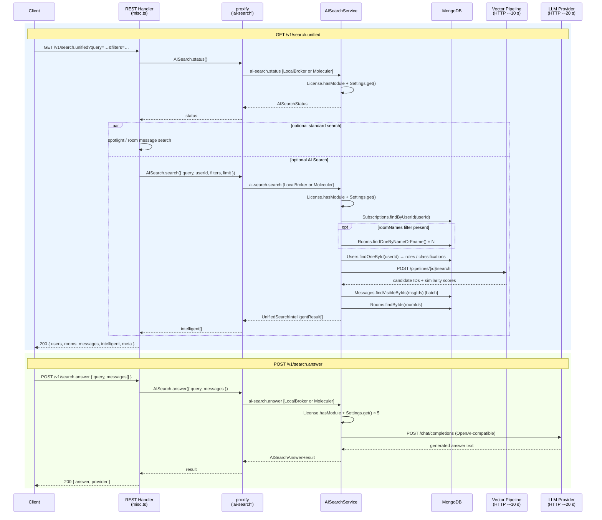

# Intelligent Search: Core vs. Apps Engine

This document compares the two viable delivery paths for the Intelligent Search feature — a native
core implementation and the existing Apps Engine app — to help the team make an informed decision
about which direction to continue investing in.

> **Context:** The current core implementation is new work built specifically for this branch. It
> is not a port of the marketplace app; it was written independently, building on domain knowledge
> from the existing app but sharing no code with it.

---

## 1. What Exists Today

### 1.1 Core Implementation (this branch)

The feature is integrated directly into the Rocket.Chat shell.

**Entry point — NavBar search bar (`NavBarSearch.tsx`)**

The global search bar (`⌘K`) is always visible. When the user opts into the AI Search Feature
Preview, a `stars` icon button is labelled **Search with AI** and navigates to
`/search?q=<query>`. If the `chat.rocket.rc-ai` add-on is missing, the same control opens the
platform upsell modal instead of navigating away. As the user types, the dropdown shows:

| Dropdown section | Content |
|---|---|
| Applied filters | Removable `Chip` components for completed filter tokens (AI Search Feature Preview and licensed workspaces only) |
| AI Search preview | Up to 3 semantic results from the pipeline, with a `stars` icon and room label |
| Filter suggestions | Context-aware completions: room names for `in:`, users for `from:`, date shortcuts for `after:`/`before:` |
| Rooms / recent | Standard subscription results |

**Inline filter system (`useSearchItems.ts`)**

Filter tokens are parsed directly from the text input using a deterministic regex:

```
FILTER_PATTERN = /(?:^|\s)(in|from|after|before):(?:"([^"]*)"|(\S+))/gi
```

| Token | Effect |
|---|---|
| `in:general` / `in:"my room"` | Scopes search to that room |
| `from:alice` | Filters by sender username |
| `after:2024-01-01` | Results after this date (ISO) |
| `before:2024-06-01` | Results before this date |

Tokens can be freely combined (`deploy issues in:devops from:bob after:2024-03`). Comma-separated
values are supported for repeated filters (`in:devops,release from:alice,bob`). Filter parsing is
license-gated in the client; without the `chat.rocket.rc-ai` add-on, the search input behaves as
the standard room search box.

`parseSearchFilterText` strips tokens and produces `{ searchText, filters }`. Completed tokens are
moved into grouped chips through `extractCompletedSearchFilters` and `buildAppliedFilterChips`.
When `getActiveFilter` detects an in-progress token (e.g. `in:dev`), the dropdown shows live
autocomplete for that token.

**Search page (`SearchPage.tsx`)**

Route `/search` — a dedicated AI Search results page. Single list, no tabs.

```
┌──────────────────────────────────────────────────┐
│  Page header: "Intelligent Search"               │
│  Results  <query>                                │
│  ✦ Searching rooms you can access where AI      │
│    Search is enabled                            │
├──────────────────────────────────────────────────┤
│  [Callouts — license / disabled / not configured]│
├──────────────────────────────────────────────────┤
│  AnswerPanel                                     │
│  ┌──────────────────────────────────────────┐   │
│  │ ✦ AI Answer              [Generate]      │   │
│  │ ─────────────────────────────────────── │   │
│  │ <Skeleton loading> → <Markdown answer>  │   │
│  │ powered by {provider} · {model}         │   │
│  └──────────────────────────────────────────┘   │
├──────────────────────────────────────────────────┤
│  Sources · N Messages            [Show more]     │
│  ┌─ SourceResult ──────────────────────────┐    │
│  │  [1]  #room  @user  Mar 15              │    │
│  │  Full message text preview…             │    │
│  └─────────────────────────────────────────┘    │
└──────────────────────────────────────────────────┘
```

- **AnswerPanel** — auto-triggers `POST /v1/search.answer` once results arrive and LLM is
  configured; shows Skeleton animation during generation (can take 5–20 seconds); renders
  response as Markdown; "Regenerate" button available; shows a clear empty state when there are no
  source results to summarize.
- **SourceResult cards** — numbered badge, room label, `@username`, formatted date, message text.
- **"Show more"** — appends 8 more results per click by updating the `intelligentCount` query
  param. No page reload.

**Server: `GET /v1/search.unified`**

The REST handler keeps HTTP concerns and the legacy search surfaces in `misc.ts`:

1. Parses query params (`rid`, `rids`, `roomNames`, `fromUsername`, `fromUsernames`, `startDate`,
   `endDate`, `includeSpotlight`, `includeMessages`, `includeIntelligent`, `intelligentCount`).
2. Calls `AISearch.status()` to return AI Search metadata and to decide whether semantic search
   can run.
3. Runs standard spotlight search in the REST handler unless `includeSpotlight=false` or the
   request is scoped to a specific `rid`.
4. Runs standard message search in the REST handler only when `includeMessages=true` and either a
   `rid` is present or global message search is enabled.
5. Calls `AISearch.search({ query, userId, filters, limit })` only when `includeIntelligent=true`,
   the license module exists, AI Search is enabled, and the pipeline is configured.
6. Returns `{ users, rooms, messages, intelligent, meta }`.

Inside `AISearchService.search()`:

1. `License.hasModule('chat.rocket.rc-ai')`, `Settings.get('AI_Intelligent_Search_Enabled')`,
   `getPipelineConfig()`, and `getUserRoomIds(userId)` run in parallel.
2. `getUserRoomIds(userId)` queries `Subscriptions.findByUserId()` for the user's rooms; this is
   the Rocket.Chat-side security boundary.
3. Room-name filters are resolved via `Rooms.findOneByNameOrFname()` for each unique room name and
   intersected with the user's subscription room IDs.
4. `buildIntelligentSearchPipelineFilters()` constructs the pipeline filter object
   (`room_id`, `username`, `timestamp`). Explicit room filters are always intersected with the
   user's subscriptions. Broad searches include the room-id filter only while the caller's room set is
   below the bounded payload limit; larger broad searches rely on mandatory post-filtering after the
   pipeline response.
5. `getUserClassifications(userId)` returns `['user', ...roles]`; these classifications are sent
   to the pipeline for role-based access policies.
6. `searchIntelligentPipeline()` posts to `{baseUrl}/pipelines/{id}/search` with the query
   (optionally formatted via `AI_Intelligent_Search_Query_Template`), classifications, filters, and
   similarity params. Timeout: **10 seconds**.
7. `normalizeIntelligentResults()` handles multiple pipeline response shapes, batch-fetches visible
   messages via `Messages.findVisibleByIds(msgIds)`, resolves each result's room from the pipeline or
   DB message, drops anything outside the user's subscriptions, and fetches room labels via
   `Rooms.findByIds(roomIds)`.

**Server: `POST /v1/search.answer`**

The REST handler validates the request and delegates to `AISearch.answer({ query, messages })`.
The service verifies license and feature enablement, reads the LLM provider settings and answer
system prompt, then calls an OpenAI-compatible `/chat/completions` endpoint with the top hits as
context. Timeout: **20 seconds**. Returns `{ answer, provider: { name, model } }`.

**Request flow sequence diagram**

Both REST handlers reach the business logic through `proxify<IAISearchService>('ai-search')`,
which routes the call through the Moleculer service broker to `AISearchService` — either in-process
(monolith) or over the network (distributed). The diagram below shows both endpoints.



**Deployment topology**

The same `AISearchService` code runs in two modes controlled by a single environment variable:

```
┌─ Monolith (default) ──────────────────────────────────────┐
│  Meteor process                                            │
│    REST handlers → proxify → LocalBroker → AISearchService │
│                                              ↓             │
│                               MongoDB · Vector Pipeline    │
│                               LLM Provider                 │
└────────────────────────────────────────────────────────────┘

┌─ Distributed (USE_EXTERNAL_AI_SEARCH_SERVICE=true) ────────┐
│  Meteor process                ee/apps/ai-search-service   │
│    REST handlers               (separate Node process)     │
│      → proxify                   AISearchService           │
│          ↕ NATS/TCP                   ↓                    │
│        Moleculer broker ─────→  MongoDB · Pipeline · LLM   │
│                                  /health on :3038          │
└────────────────────────────────────────────────────────────┘
```

**Settings (`ai.ts`) — 13 enterprise settings**

All settings use `enterprise: true`, `modules: ['chat.rocket.rc-ai']`, and `invalidValue`, meaning
they silently fall back to their invalid value when the license module is inactive.

| Section | Settings |
|---|---|
| `AI_LLM_Provider` / LLM Providers | OpenAI-compatible base URL, API key, model (lookup type — live dropdown from `/v1/ai.llm.models`) |
| `Intelligent_Search` | Enabled (public), Show in top bar (public), Pipeline URL, Pipeline ID, API key, API key secret, Min similarity %, Query template, Answer system prompt |
| `AI_Thread_Summarization` | Enabled (public) |

**AI Center admin page (`AICenterRoute.tsx`)**

Route `/admin/ai-center` with an overview of all AI capabilities as feature cards (Intelligent
AI Search and OpenAI-compatible LLM configuration) and sub-routes into the
relevant settings sections, rendered via the standard `GenericGroupPage` component.

---

### 1.2 Existing Apps Engine App (`intelligent-search` repo)

A fully implemented marketplace app (v0.2.0, `addon: chat.rocket.rc-ai`). Its key characteristics:

**Entry point**

Slash command (`/search`) and message-reaction trigger. No NavBar integration is possible within
Apps Engine.

**Filter extraction**

`LexicalFilterExtractor` — a deterministic NLP-style extractor that parses natural language for
`@username` mentions, `#room` mentions, relative/absolute time expressions, and self-references.
An optional LLM-assisted extraction layer (`enable_filter_extraction` setting) can be layered on
top when accuracy on complex queries matters. The clean query and extracted filters are sent to the
pipeline via `buildPipelineSearchPayload`, which produces the same payload shape as the core
implementation.

**Message fetch**

`SearchResultsPresenter` iterates results and calls `read.getMessageReader().getById(msgId)` for
each — one IPC round-trip per message.

**Results presentation**

UIKit `PreviewBlock` and `SectionBlock` layouts posted as thread replies on the original `/search`
message. Pagination is handled by `SearchPaginationService`, which posts "Prev / Next" `ActionsBlock`
buttons in the thread. The app also auto-deletes stale entries from the vector DB when a
`getById` call returns nothing (the message was deleted from Rocket.Chat).

**LLM answer**

The app immediately posts a "Searching…" message, then posts the answer as a thread reply when the
LLM finishes — a workaround for the UIKit interaction timeout.

**Settings (17)**

Five sections: Pipeline Connection, Mongo Connector, LLM Connection, Search Experience, Logging &
Access. All string/number/boolean/password/select types — no `lookup` type, no `enterprise` flag,
no `modules` gating.

---

## 2. Capability Comparison

```
✅ Equivalent   ⚠️ Partial / workaround   ❌ Not achievable without platform changes
```

| Capability | Core | Apps Engine app | Notes |
|---|---|---|---|
| Outbound HTTP to pipeline | ✅ | ✅ | Both work equally well |
| Role-based pipeline classifications | ✅ | ✅ `IUserRead` + roles | No gap |
| Inline filter tokens (`in:`, `from:`, `after:`, `before:`) in NavBar | ✅ | ❌ | No NavBar surface in Apps Engine |
| Filter autocomplete suggestions in NavBar dropdown | ✅ | ❌ | No NavBar dropdown extension |
| Applied filter chips (removable) in NavBar dropdown | ✅ | ❌ | No NavBar dropdown extension |
| Intelligent preview (3 results) while typing in NavBar | ✅ | ❌ | No NavBar dropdown extension |
| Dedicated full-page search route (`/search`) | ✅ | ❌ | Apps have modal / contextualBar / home only |
| URL-bookmarkable search state | ✅ | ❌ | No URL for contextual bar |
| `SourceResult` cards (numbered, room, user, date, text) | ✅ React | ⚠️ UIKit PreviewBlock | Rich layout becomes constrained UIKit blocks |
| `AnswerPanel` — auto-triggered, Skeleton, Markdown | ✅ | ⚠️ Thread reply (manual trigger) | Must poll thread; no inline loading state |
| LLM answer — 20s+ without timeout | ✅ | ⚠️ Thread reply pattern | UIKit action handlers time out at ~5s |
| "Show more" pagination with page state | ✅ `useState` | ⚠️ Prev/Next buttons in thread | Different UX; no page-level state |
| Batch message hydration (1 DB query) | ✅ `Messages.findVisibleByIds()` | ⚠️ `getById()` × N calls | N sequential IPC round-trips |
| Room name → ID resolution | ✅ `Rooms.findOneByNameOrFname()` × N | ⚠️ `IRoomRead.getByName()` × N | Core still intersects with subscriptions server-side |
| AI Center integrated settings page | ✅ `/admin/ai-center` | ❌ `Apps > [App]` only | Isolated from the rest of AI Center |
| `enterprise: true` + `modules: [...]` + `invalidValue` | ✅ | ❌ No enterprise flag for app settings | Settings always visible regardless of license |
| `License.hasModule('chat.rocket.rc-ai')` server-side | ✅ | ❌ No license module accessor | Cannot gate features by module |
| `lookup` setting type (live model dropdown) | ✅ | ❌ Not available in Apps Engine | Model selection is a free-text field |
| Upsell modal for unlicensed users | ✅ `GenericUpsellModal` | ❌ | No standard upsell pattern |
| Workspace / index management UI | ❌ (not yet in core) | ✅ Workspace Manager modal | App has richer admin tooling here |
| Natural-language filter extraction (LLM-assisted) | ❌ (token-only today) | ✅ `LexicalFilterExtractor` | App supports fuzzier natural-language queries |
| Auto-delete stale vector DB entries | ❌ | ✅ On `getById` miss | App maintains index health proactively |

---

## 3. The LLM Answer Timing Problem

This is the most concrete functional gap when running inside Apps Engine.

**Core (current behaviour)**

```
User arrives on /search → results load
    → useEffect: canGenerateAnswer = true
    → POST /v1/search.answer (no user interaction needed)
    → Server: fetch() to LLM, timeout: 20 seconds
    → AnswerPanel renders Skeleton animation throughout
    → Answer arrives → MarkdownText renders inline
Total wait: 5–20s, visible loading state, inline failure / empty states
```

**Apps Engine contextual bar**

```
User opens contextual bar → clicks "Generate Answer"
    → UIKit block action fires
    → App handler starts IHttp.post() → LLM (5–20s)
    → UIKit runtime expects handler response within ~5s
    → Timeout error returned to client before LLM finishes
```

The only viable workaround is the thread-reply pattern the app currently uses: post a placeholder
message immediately, then post the answer as a thread reply when the LLM finishes. This works
reliably, but it changes the interaction model — the user leaves the search context, returns to
the channel, and reads the answer in a thread rather than seeing it appear inline on the same page.

---

## 4. Effort Comparison

### Option A — Continue with core implementation

| Area | Status |
|---|---|
| Filter token parsing (`in:`, `from:`, `after:`, `before:`) | ✅ Done |
| `parseSearchFilterText` + `buildAppliedFilterChips` | ✅ Done |
| `getActiveFilter` + live filter suggestions in dropdown | ✅ Done |
| AI Search preview (3 results) in NavBar dropdown | ✅ Done |
| Applied filter chips (removable) | ✅ Done |
| `GET /v1/search.unified` with filter params | ✅ Done |
| Server-side room name resolution | ✅ Done |
| User role classifications sent to pipeline | ✅ Done |
| Pipeline HTTP call with filters + classifications | ✅ Done |
| Multiple pipeline response shape normalisation | ✅ Done |
| Batch DB message hydration | ✅ Done |
| Security filter (subscription check) | ✅ Done |
| `@rocket.chat/ai-search` pure logic package | ✅ Done |
| `IAISearchService` core-services interface | ✅ Done |
| `ee/apps/ai-search-service` standalone service | ✅ Done |
| `POST /v1/search.answer` + auto-triggered LLM generation | ✅ Done |
| `SourceResult` cards + `AnswerPanel` + Skeleton | ✅ Done |
| "Show more" pagination | ✅ Done |
| AI Center overview + settings sub-pages | ✅ Done |
| 13 enterprise settings with `invalidValue` + module gating | ✅ Done |
| `AI_LLM_OpenAI_Model` lookup setting (live model dropdown) | ✅ Done |
| License-gated upsell modal | ✅ Done |
| Workspace / index management UI | ❌ Not yet implemented |
| Integration tests with live pipeline | ❌ Not yet done |

**Estimated remaining work: 2–4 weeks** (workspace management UI, operational hardening, and live
pipeline integration testing can run in parallel).

---

### Option B — Maintain and extend the existing Apps Engine app

The app already exists and handles the core pipeline interaction well. Adopting it as the primary
path would mean:

| Gap to close | Effort | Constraints |
|---|---|---|
| Replace NavBar entry point with slash command (accept regression) | — | Already done; this accepts the loss of NavBar integration |
| Inline LLM answer (overcome 5s UIKit timeout) | ❌ Not feasible without platform change | Thread-reply pattern is the only viable path |
| Full-page search route | ❌ Not feasible | No full-page route surface in Apps Engine |
| Rich result cards (Skeleton, Markdown) | ❌ Not feasible | UIKit layout blocks are the ceiling |
| License module gating (`enterprise: true` + `modules: [...]`) | ❌ Not feasible | Platform would need to expose `ILicenseRead.hasModule()` |
| Integrated AI Center settings page | ❌ Not feasible | App settings are isolated to `Apps > [App]` |
| `lookup` type for model dropdown | ❌ Not feasible | Not available in Apps Engine settings |
| Remaining existing gaps above | ~2–3 weeks | Only closeable gaps |

**Current feature parity vs. core: ~45%** (the app handles pipeline calls, filter extraction,
results presentation, pagination, and workspace management well, but the NavBar, inline LLM
answer, rich page layout, and license integration are out of reach).

---

### Option C — Apps Engine app + platform extensions

To achieve genuine parity via Apps Engine, several platform capabilities would need to be built
first:

| Extension needed | Estimate |
|---|---|
| NavBar UIKit surface (inject into global search input + dropdown) | 4–6 weeks |
| Async block action result delivery (overcome ~5s timeout) | 2–3 weeks |
| `IMessageRead.getByIds(ids[])` batch method in bridge | 3–5 days |
| `ILicenseRead.hasModule(moduleId)` accessor for apps | 1 week |
| App settings `enterprise: true` + `modules: [...]` + `invalidValue` | 1–2 weeks |
| `lookup` setting type in Apps Engine | 3–5 days |
| Admin panel page surface for apps | 5–8 weeks |

**Platform work subtotal: ~14–21 weeks**
**App updates on top: ~3–4 weeks**
**Total: ~4–6 months**

This path also introduces multi-team coordination dependencies, making the schedule less
predictable.

---

## 5. UX Comparison

| Dimension | Core | Apps Engine app |
|---|---|---|
| **Entry point** | Global NavBar `✦` button, always visible (`⌘K`) | `/search` slash command in a room |
| **Filter input** | Inline `in:room from:user after:date` tokens with autocomplete | Natural-language extraction (deterministic + optional LLM-assisted) |
| **Filter feedback** | Applied chips shown in NavBar dropdown, clickable to remove | Extracted filters logged; no visual chip feedback |
| **AI Search preview** | 3 results shown instantly in NavBar dropdown while typing | None before slash command is submitted |
| **Results view** | Dedicated full-page `/search`, URL-bookmarkable | Thread reply on the original search message |
| **Result cards** | Numbered, room label, `@username`, date, message text | UIKit PreviewBlock / SectionBlock |
| **LLM answer** | Auto-triggered inline, Skeleton loading, Markdown rendered | Thread reply posted when LLM finishes; user navigates away to read |
| **Pagination** | Inline "Show more" button, no reload | Prev/Next buttons in thread |
| **Admin settings** | Integrated into AI Center alongside OpenAI-compatible LLM configuration | Isolated under `Apps > Intelligent Search` |
| **License gating** | Module-level control; Locked/Disabled/Enabled tags; upsell modal | Always visible; no tiering |
| **Workspace management** | Not yet implemented | Full Workspace Manager modal (connector, room selection, backfill, pipeline config) |
| **Deep linking** | URL carries full search state | No URL; state lost on close |
| **Feature discoverability** | `✦` icon always in NavBar | Must know `/search` exists |

---

## 6. Our Preference for Core

The choice ultimately comes down to the kind of feature IS is, and where its primary value lives.

**Feature class**

Apps Engine is well-suited for third-party integrations — connectors, bots, and features that
augment the existing UI by adding room actions or responding to messages. The IS feature is
different: its primary value is in how users discover and invoke it (always-visible NavBar, inline
filter chips, semantic preview as you type) and in the quality of the results page (inline LLM
answer, rich result cards, Markdown rendering). Both of those are built on React surfaces that
Apps Engine cannot reach.

**The 5s timeout is a hard constraint, not a configuration option**

The inline LLM answer is one of the most visible differentiators of this feature. Presenting it
inline, auto-triggered, with a live loading state is what sets it apart from a basic keyword
search. The thread-reply workaround works as a fallback, but it changes the interaction model in a
way that weakens the core value proposition. This is not a gap that can be closed without platform
changes, and those changes would take significantly longer than completing the core implementation.

**The existing app has real strengths**

The Apps Engine app has capabilities the core implementation does not — the Workspace Manager
modal for index administration, LLM-assisted natural-language filter extraction, and proactive
index health maintenance. These are worth incorporating into the core path rather than maintaining
two separate implementations.

**Integration with the AI Center family**

AI Search and OpenAI-compatible LLM configuration live in the same `AI_Center` settings group under
the same `chat.rocket.rc-ai` license module. Keeping IS in the
same family means consistent settings management, consistent license gating, and a coherent admin
experience across all AI capabilities.

**Summary**

| | Core | Apps Engine (as-is) | Apps Engine + platform work |
|---|---|---|---|
| **Feature parity** | ~80% (workspace mgmt missing) | ~45% | ~95% |
| **Estimated remaining work** | 2–4 weeks | Accepts regressions | 4–6 months |
| **Inline LLM answer UX** | ✅ Auto-triggered, Markdown | ⚠️ Thread reply | ✅ (if platform delivers) |
| **NavBar integration** | ✅ Filter chips, preview, autocomplete | ❌ | ✅ (if platform delivers) |
| **AI Center integration** | ✅ | ❌ Isolated | ✅ (if platform delivers) |
| **License gating** | ✅ Module-level | ❌ None | ✅ (if platform delivers) |
| **Workspace manager** | ❌ Not yet | ✅ Full modal | ✅ |

The preferred path is to continue with the core implementation, bring across the workspace
management and index health capabilities from the existing app, and retire the app once the core
feature reaches parity.

---

## 7. Microservice Architecture Considerations

### Current architecture

The IS feature ships with two deployment modes (see the sequence diagram in Section 1.1):

- **Monolith (default):** `AISearchService` is registered in the Meteor process. REST handlers in
  `misc.ts` call it via `proxify<IAISearchService>('ai-search')` → Moleculer LocalBroker → service.
- **Distributed:** Set `USE_EXTERNAL_AI_SEARCH_SERVICE=true` in the Meteor app and start
  `ee/apps/ai-search-service` as a separate Node process. It connects to the same Moleculer broker
  over NATS or TCP and exposes a `/health` endpoint on port 3038.

```
Client → GET /v1/search.unified → proxify('ai-search') → AISearchService
                                                            ├── MongoDB
                                                            └── HTTP → Vector pipeline (~10 s)

Client → POST /v1/search.answer → proxify('ai-search') → AISearchService
                                                            └── HTTP → LLM endpoint (~20 s)
```

The implementation keeps three layers separate:

| Layer | Responsibility |
|---|---|
| `@rocket.chat/ai-search` | Pure, framework-independent logic for pipeline filters, pipeline calls, result normalization, OpenAI-compatible answers, and model lookup |
| `AISearchService` | Rocket.Chat orchestration: license and setting checks, subscription security boundary, room/user/message hydration, and calls to the pure package |
| REST handlers | HTTP validation, standard spotlight/message search, response shaping, and error translation |

This works well at low to moderate concurrency and can be deployed as a separate service when AI
Search load should be isolated from the Meteor process.

### What breaks under high concurrency

Consider a workspace with 10,000 users where 1,000 users perform searches simultaneously.

Each in-flight AI Search request can open:
- one outbound HTTP connection to the vector pipeline, held for up to the 10 second timeout
- one outbound HTTP connection to the LLM answer provider, held for up to the 20 second timeout

The MongoDB queries within each request (Subscriptions, Messages, Rooms, Users) are *not* a
meaningful bottleneck here. The Node.js MongoDB driver checks out a connection per operation and
returns it to the pool as soon as the query completes — typically within a few milliseconds. While
the pipeline and LLM HTTP calls are in-flight, no MongoDB connections are held. This is the same
pattern that handles 10,000 active users already.

The real pressure points at 1,000 concurrent requests:

| Resource | Impact |
|---|---|
| Node.js event loop | Thousands of in-flight async callbacks, JSON parsing of large HTTP responses, and result normalisation — all on the same thread that handles messaging and notifications |
| Memory | 1,000 buffered HTTP response bodies held in-process simultaneously while awaiting pipeline and LLM responses |
| LLM endpoint | Rate limits hit immediately — no queuing or backpressure exists today; requests either fail or queue inside the LLM provider with no visibility |
| Process stability | Sustained memory pressure from long-lived HTTP connections can trigger OOM, taking down messaging and presence alongside search |

The distributed service removes this pressure from the Meteor process, but request-level
backpressure, per-provider concurrency caps, and circuit breakers are still hardening work to add
before promoting the service as the default enterprise-scale deployment.

### What a dedicated microservice provides

Rocket.Chat's microservice model uses Moleculer as the broker (`@rocket.chat/core-services`).
Services communicate via `api.call()` (proxify) in a monolith or over the network in a
distributed deployment. The dedicated `AISearchService` now provides:

| Concern | Benefit |
|---|---|
| **Process isolation** | IS load (memory + event loop pressure from long-lived HTTP connections) cannot degrade messaging, presence, or other RC operations |
| **Horizontal scaling** | Multiple IS instances behind Moleculer load balancing; scaled independently from the main RC cluster |
| **Deployment flexibility** | Same implementation runs in-process for simple deployments or out-of-process for larger installations |
| **Restart isolation** | IS service can be restarted or updated without restarting the full Rocket.Chat server |
| **Clear ownership boundary** | LLM, vector pipeline, and result hydration logic live behind `IAISearchService` rather than inside REST handlers |

It does **not** yet configure a service-level queue, request concurrency cap, or circuit breaker.
Those should be treated as the next operational-hardening step rather than as already-delivered
behavior.

### The LLM is the real ceiling — queuing is not optional

Even with 5 IS service replicas, you cannot fire 1,000 concurrent LLM calls. The LLM provider
(whether OpenAI-compatible or self-hosted) has a finite throughput. The correct behaviour at
saturation is to **queue** requests with a concurrency cap, not to reject them or let them pile
up in-process.

A microservice is the natural place to own this queue. Implementing it inside the Meteor API
handler is possible but awkward: it doesn't survive restarts cleanly, it's not observable, and
it mixes concerns with the HTTP routing layer.

### Migration path

The migration from REST-embedded logic to a service boundary is complete in this branch:

| Step | Status |
|---|---|
| Extract pure pipeline and LLM logic into `@rocket.chat/ai-search` | ✅ Done |
| Define `IAISearchService` in `packages/core-services/src/types/IAISearchService.ts` | ✅ Done |
| Expose `AISearch = proxify<IAISearchService>('ai-search')` | ✅ Done |
| Implement `AISearchService` as a `ServiceClass` | ✅ Done |
| Register `AISearchService` in monolith mode | ✅ Done |
| Add `USE_EXTERNAL_AI_SEARCH_SERVICE` escape hatch for distributed deployments | ✅ Done |
| Add `ee/apps/ai-search-service` with tracing, model registration, broker startup, and `/health` | ✅ Done |
| Replace REST handler business logic with `AISearch.status/search/models/answer` calls | ✅ Done |

The remaining work is not migration; it is production hardening:

| Hardening item | Why it matters |
|---|---|
| Service-level concurrency caps for pipeline and LLM calls | Prevents large workspaces from overwhelming providers or exhausting memory |
| Queueing / backpressure with observable pending counts | Gives predictable behavior under bursts instead of failing unpredictably |
| Circuit breaker around pipeline and LLM failures | Avoids long waits and cascading failures when dependencies are down |
| Metrics for latency, errors, result counts, and answer generation | Needed for SRE visibility and capacity planning |
| Integration tests with a representative pipeline | Verifies filters, role classifications, result hydration, and answer generation end-to-end |

### Recommendation

| Deployment scale | Recommended architecture |
|---|---|
| Small / medium workspace | Monolith registration is acceptable; no extra operational component |
| Large workspace or AI-heavy usage | Run `ee/apps/ai-search-service` separately with `USE_EXTERNAL_AI_SEARCH_SERVICE=true` |
| Very large / multi-node deployment | Scale AI Search service replicas independently and add provider-level concurrency controls |

The current service boundary is the right production shape. The next decision is operational:
whether to run it in-process for simple deployments or out-of-process when AI Search traffic needs
isolation and independent scaling.
