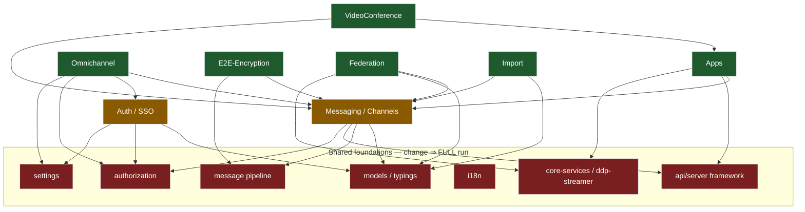

# CI Time Reduction Strategy — Change-Aware Test Selection

Status: Proposal
Owner: Platform / DevEx
Scope: `.github/workflows/ci.yml`, `ci-test-e2e.yml`, `ci-test-unit.yml`, `ci-code-check.yml`

## 1. Goal

Cut wall-clock and compute cost of PR CI by **not running work that a PR cannot
possibly affect**. Concretely: eliminate execution of `📦 Meteor Build`,
`🔨 Test API` and `🔨 Test UI` (and their EE/livechat variants) for PRs whose
changes fall outside those jobs' blast radius.

Reference case: [PR #41376](https://github.com/RocketChat/Rocket.Chat/pull/41376)
adds a design doc plus refactors inside `packages/apps/base-runtime/` (Apps
base‑runtime accessors) and its co‑located unit tests. The blast radius is the
**Apps domain**. There is no reason to run Omnichannel, admin, messaging,
federation, or the bulk of the API suite for it.

## 2. Current pipeline anatomy

The PR pipeline is a single dependency chain. Everything expensive hangs off
the Meteor build:

```
release-versions (⚙️ variables, computes hashes + diff)
  └─ packages-build (📦 yarn build of all workspaces)
        ├─ checks (🔎 ts + lint)                    ← gates e2e
        ├─ test-unit (🔨 turbo run testunit)
        ├─ test-storybook
        └─ build  (📦 Meteor Build: production + coverage)   ◀── CULPRIT #1
              └─ build-gh-docker (🚢 6 service images × 2 arch)
                    └─ build-gh-docker-publish (multi-arch manifests)
                          ├─ test-api        (🔨 Test API CE)          ◀── CULPRIT #2
                          ├─ test-api-ee     (🔨 Test API EE)
                          ├─ test-api-livechat / -ee
                          ├─ test-api-apps-node-ee
                          ├─ test-ui         (🔨 Test UI CE, 4 shards) ◀── CULPRIT #3
                          ├─ test-ui-ee      (🔨 Test UI EE, 5 shards)
                          └─ test-federation-matrix
  (all of the above feed) tests-done  ✅  ← the aggregation gate
```

Key structural facts (verified in the workflows):

- **E2E is holistic, not per‑package.** `test-api`/`test-ui` boot a full
  Rocket.Chat Docker image built from the Meteor bundle and exercise it end to
  end. So the tests depend on the *build*, and the build depends on essentially
  the whole server + client tree. You cannot cheaply run "just the API tests for
  package X" — you first pay for a full build + docker.
- **Two distinct savings modes** follow from that:
  - **Mode A — skip the whole chain.** If a change provably cannot alter the
    running server/client bundle (docs only, a non‑bundled workspace, another
    app such as `apps/uikit-playground`, CI config for an unrelated job), then
    `build` → `docker` → *all* E2E can be skipped. This is the biggest lever.
  - **Mode B — narrow the E2E scope.** If a change does affect the bundle but is
    confined to an isolated leaf domain (the Apps case), you still must build +
    dockerize, but you can run only the relevant E2E suites/specs and skip the
    rest.
- **`tests-done` is the merge gate.** It `needs` every test job and, with
  `if: always()`, fails unless each result is exactly `success`. Any job we
  skip currently makes this gate fail. **This is the single most important
  thing to fix** before skipping anything (see §6).
- **Only existing path gating** is `paths-ignore: ['**.md']` on `ci.yml`. There
  is no `dorny/paths-filter`, no `tj-actions/changed-files`, and no
  `turbo --affected` / git‑range `--filter` anywhere. Turbo `--filter` is used
  only for build scoping (`build:services`, `dev`, `dsv`).
- Merge queue is in use (`merge_group` trigger) and Kodiak drives merges
  (`.kodiak.toml`, `block_on_neutral_required_check_runs = true`). Required
  status checks and merge‑queue semantics therefore constrain the design.

## 3. Core idea: one classification job → conditional fan‑out

Introduce a single early job — `changes` — that runs right after
`release-versions`, computes the PR's changed files once, maps them to a small
set of boolean **capability flags**, and exposes them as outputs. Every
downstream job gates on those flags. One source of truth, computed once, no
per‑job `git diff`.

```
release-versions ─▶ changes ─▶ (build? test-api? test-ui? test-ui-ee? …)
```

The mapping is a **decision tree**, evaluated most‑conservative‑first:

1. **Full‑run triggers (safety first).** If the event is `push` to `develop`,
   a `release`, a `merge_group`, or the PR carries a `ci: full` label, or the
   diff touches "core/shared" surfaces (see below) — set **every** flag true.
   Never optimize the main branch or releases; correctness there is paramount.
2. **Build‑affecting?** If any changed path is compiled into the Meteor
   server/client bundle or the microservice images, set `build=true`. If not
   (docs‑only, non‑bundled workspace, unrelated CI), `build=false` ⇒ Mode A:
   skip build, docker and all E2E.
3. **Per‑domain E2E flags.** When `build=true`, decide which E2E suites are in
   scope from the changed domains (Mode B).

### "Core/shared" tripwire → always full

Some paths are load‑bearing for everything. Touching them forces a full run,
no exceptions. Start deliberately broad and shrink over time:

- `yarn.lock`, `package.json`, `.yarnrc.yml`, `turbo.json`, `.tool-versions`
- `packages/core-typings`, `packages/rest-typings`, `packages/model-typings`,
  `packages/models`, `packages/core-services`, `packages/ddp-client`,
  `packages/api-client`, `packages/i18n`, `packages/tools`, `packages/logger`
- `apps/meteor/server/lib/**`, `apps/meteor/server/services/**` (shared infra),
  `apps/meteor/app/authorization/**`, `apps/meteor/app/settings/**`,
  `apps/meteor/lib/**`, `apps/meteor/definition/**`
- `docker-compose-ci.yml`, `.github/workflows/**`, `.github/actions/**`

The guiding rule: **a false "skip" (a real regression slips through) is far more
expensive than a false "run" (wasted minutes).** Bias every ambiguous mapping
toward running.

## 4. Layered rollout

Each layer is independently shippable and independently valuable. Ship in order;
each one buys confidence for the next.

### Layer 0 — Fix the gate (prerequisite, zero behavior change)

Rewrite `tests-done` so a `skipped` need counts as success and only `failure`/
`cancelled` fail the gate. Until this lands, nothing downstream may be skipped.
Details in §6. Ship this alone first and confirm the merge queue is still green.

### Layer 1 — Coarse Mode‑A skips (safe, immediate, big win)

Add the `changes` job and gate `build` (and therefore everything downstream) on
`build=true`. Initial classifier only needs to answer *"could this change the
bundle or images?"* Conservative first cut:

- `build=false` when **every** changed file matches an ignore set:
  `**/*.md`, `docs/**`, `**/*.stories.tsx`, `apps/uikit-playground/**`,
  `.github/ISSUE_TEMPLATE/**`, `.changeset/**` (changesets alone), `.vscode/**`,
  `.cursor/**`, images/assets with no runtime path.
- Otherwise `build=true`.

This alone takes doc/proposal/storybook‑playground PRs from "full pipeline" to
"lint + unit only". The current `paths-ignore: '**.md'` is a blunt superset of
this; we replace it with a job‑level gate so a *mixed* docs+playground PR is
still skipped, while a docs+code PR correctly runs.

> Note: keep a minimal `paths-ignore` OR drop it — but if a required check is
> configured on a job that a `paths-ignore` prevents from ever starting, the PR
> hangs "Expected — waiting for status". Prefer *always starting* the workflow
> and skipping *inside* it via the gate. See §6.

### Layer 2 — Graph‑aware "affected" for unit/lint/storybook (without deep history)

For the non‑E2E jobs (which *are* per‑package), run only the changed packages
plus their dependents instead of all 42 `testunit` packages every time.

**We do not use `turbo --affected`.** That flag couples "what changed" to git
diffing and needs the merge‑base commit in local history; under a shallow
checkout it silently falls back to "everything changed" (see §10.1 — full
history is off the table at ~30k commits). Instead we **decouple** the two
things `--affected` bundles:

1. *What changed* — the changed‑file list, from the GitHub API (no history).
   The repo already does this in `release-versions` via `gh pr diff
   --name-only`; reuse that.
2. *What is affected + dependents* — a **static** graph query (no history). Map
   changed files → owning workspace (workspace globs), then expand to dependents
   with an explicit turbo filter:

```bash
# CHANGED_PKGS derived from the API file list (e.g. @rocket.chat/models @rocket.chat/apps)
FILTERS=$(printf -- '--filter=...%s ' $CHANGED_PKGS)   # ...<pkg> = pkg + its dependents
yarn turbo run testunit lint typecheck $FILTERS
```

- Runs on a default depth‑1 checkout; the dependent expansion is static graph
  data, so no merge‑base is required.
- On `develop`/`release`/`merge_group`, drop the filters and run everything.
- Fail‑open: if the file→package mapping is uncertain, run all.

This keeps turbo's graph authority for package‑scoped tasks while respecting the
checkout constraint.

### Layer 3 — Domain‑scoped E2E selection (Mode B, the Apps example)

Only meaningful once Layers 0–2 are trusted. Map changed domains → E2E flags and
pass them into the reusable `ci-test-e2e.yml`.

E2E surfaces available today:

| Suite (job)              | Runner / config                                   | Spec source |
|--------------------------|---------------------------------------------------|-------------|
| `test-api` (CE/EE)       | `mocha .mocharc.api.js`                            | `tests/end-to-end/api/*.ts` **and** `tests/end-to-end/apps/*` |
| `test-api-livechat`      | `mocha .mocharc.api.livechat.js`                  | `tests/end-to-end/api/livechat/**` |
| `test-api-apps-node-ee`  | `mocha .mocharc.api.apps.js`                       | `tests/end-to-end/apps/*` |
| `test-ui` (CE 4 shards)  | `playwright test --shard`                          | `tests/e2e/**` (root, `omnichannel/`, `apps/`, `e2e-encryption/`) |
| `test-ui-ee` (5 shards)  | same                                               | same |
| `test-federation-matrix` | jest integration                                  | `ee/packages/federation-matrix` |

Two granularities, pick per‑suite:

- **Job‑level (coarse, low‑risk).** Skip whole suites the domain can't touch.
  E.g. an Apps‑only change skips `test-api-livechat*` and `test-federation-matrix`
  outright. A change with no Omnichannel/livechat paths skips the livechat jobs.
- **Spec‑level (fine, higher‑risk).** Narrow *within* a suite. Playwright accepts
  path/grep filters, so an Apps‑only change can run
  `playwright test tests/e2e/apps` instead of the full 4–5 shard sweep. The API
  mocha configs use static globs, so spec‑level selection there means either a
  changed‑files→spec resolver that passes an explicit file list to mocha, or new
  narrow `.mocharc` configs per domain.

Recommended domain map (extend incrementally; unknown ⇒ full):

| Changed paths | E2E scope |
|---|---|
| `packages/apps*/**`, `apps/meteor/app/apps/**`, `apps/meteor/ee/server/apps/**`, `apps/meteor/server/services/apps-engine/**` | API `apps` specs + UI `tests/e2e/apps/**`; skip livechat + federation |
| Omnichannel/livechat dirs, `ee/apps/omnichannel-transcript`, `packages/livechat` | livechat API + UI `omnichannel/**` |
| `ee/packages/federation-matrix/**`, federation dirs | `test-federation-matrix` + UI `federation` |
| E2EE dirs | UI `e2e-encryption/**` |
| anything in the §3 core/shared tripwire | **full** |

Playwright's round‑robin sharding is global, so when a domain is scoped down to a
handful of specs, collapse the shard matrix to 1 shard for that run to avoid
spinning up 4–5 near‑empty jobs.

## 5. Reference implementation

### 5.1 The `changes` job (using `dorny/paths-filter`)

```yaml
  changes:
    name: 🧭 Detect changes
    needs: [release-versions]
    runs-on: ubuntu-24.04-arm
    permissions:
      contents: read
      pull-requests: read
    outputs:
      full:      ${{ steps.decide.outputs.full }}
      build:     ${{ steps.decide.outputs.build }}
      apps:      ${{ steps.filter.outputs.apps }}
      livechat:  ${{ steps.filter.outputs.livechat }}
      federation:${{ steps.filter.outputs.federation }}
    steps:
      - uses: actions/checkout@v6
        with: { fetch-depth: 0 }

      - name: Force-full triggers
        id: force
        run: |
          full=false
          case "${{ github.event_name }}" in release|merge_group|push) full=true ;; esac
          if [[ "${{ contains(github.event.pull_request.labels.*.name, 'ci: full') }}" == "true" ]]; then full=true; fi
          echo "full=$full" >> "$GITHUB_OUTPUT"

      - uses: dorny/paths-filter@v3
        id: filter
        with:
          filters: |
            core: &core
              - 'yarn.lock'
              - 'package.json'
              - 'turbo.json'
              - '.github/workflows/**'
              - '.github/actions/**'
              - 'docker-compose-ci.yml'
              - 'packages/core-typings/**'
              - 'packages/rest-typings/**'
              - 'packages/models/**'
              - 'packages/core-services/**'
              - 'apps/meteor/server/lib/**'
              - 'apps/meteor/app/authorization/**'
              - 'apps/meteor/app/settings/**'
            bundle:
              - '!(**/*.md|docs/**|**/*.stories.tsx|apps/uikit-playground/**|.changeset/**|.vscode/**|.cursor/**)'
            apps:
              - 'packages/apps*/**'
              - 'apps/meteor/app/apps/**'
              - 'apps/meteor/ee/server/apps/**'
              - 'apps/meteor/server/services/apps-engine/**'
            livechat:
              - 'packages/livechat/**'
              - 'apps/meteor/app/livechat/**'
              - 'ee/apps/omnichannel-transcript/**'
            federation:
              - 'ee/packages/federation-matrix/**'
              - 'apps/meteor/app/federation*/**'

      - name: Decide flags
        id: decide
        run: |
          FULL=${{ steps.force.outputs.full }}
          if [[ "${{ steps.filter.outputs.core }}" == "true" ]]; then FULL=true; fi
          echo "full=$FULL" >> "$GITHUB_OUTPUT"
          if [[ "$FULL" == "true" || "${{ steps.filter.outputs.bundle }}" == "true" ]]; then
            echo "build=true" >> "$GITHUB_OUTPUT"
          else
            echo "build=false" >> "$GITHUB_OUTPUT"
          fi
```

### 5.2 Gating downstream jobs

```yaml
  build:
    needs: [release-versions, packages-build, changes]
    if: needs.changes.outputs.build == 'true'
    # ...

  test-api:
    needs: [checks, build-gh-docker-publish, release-versions, changes]
    if: needs.changes.outputs.build == 'true'          # runs whenever the bundle changed
    # ...

  test-api-livechat:
    needs: [checks, build-gh-docker-publish, release-versions, changes]
    if: needs.changes.outputs.full == 'true' || needs.changes.outputs.livechat == 'true'
    # ...

  test-federation-matrix:
    needs: [checks, build-gh-docker-publish, packages-build, release-versions, changes]
    if: needs.changes.outputs.full == 'true' || needs.changes.outputs.federation == 'true'
    # ...
```

For spec‑level UI scoping, thread a `spec-filter` input through
`ci-test-e2e.yml` and append it to the Playwright invocation:

```yaml
# ci.yml → test-ui
    with:
      spec-filter: ${{ needs.changes.outputs.full == 'true' && '' || (needs.changes.outputs.apps == 'true' && 'tests/e2e/apps' || '') }}
      shard:       ${{ needs.changes.outputs.full == 'true' && '[1,2,3,4]' || '[1]' }}
      total-shard: ${{ needs.changes.outputs.full == 'true' && 4 || 1 }}
```

```yaml
# ci-test-e2e.yml → E2E Test UI step
        run: |
          yarn prepare
          yarn test:e2e ${SPEC_FILTER} --shard="$E2E_SHARD/$E2E_TOTAL_SHARD"
```

## 6. The merge‑gate mechanics (do this right or PRs hang)

This is the part that breaks naive implementations.

1. **Skipped counts as success for branch protection**, but a *skipped* result
   still trips the current `tests-done` (`!= 'success'` ⇒ exit 1). Rewrite it so
   only `failure`/`cancelled` fail:

   ```yaml
   tests-done:
     needs: [checks, test-unit, test-api, test-ui, test-api-ee, test-ui-ee,
             test-api-livechat, test-api-livechat-ee, test-federation-matrix, changes]
     if: always()
     runs-on: ubuntu-24.04-arm
     steps:
       - name: Aggregate
         run: |
           results='${{ join(needs.*.result, ',') }}'
           echo "results: $results"
           if grep -qE '(^|,)(failure|cancelled)(,|$)' <<< "$results"; then
             echo "A required job failed or was cancelled"; exit 1
           fi
           echo "ok"
   ```

2. **Keep `tests-done` as the *only* required status check** (plus `checks`),
   and make sure it is a required check for both the PR and `merge_group`
   contexts. Because it always runs and always reports, PRs never hang on
   "Expected — waiting for status", even when every test underneath is skipped.
   Do **not** mark individual test jobs as required — they legitimately go
   missing/skipped.

3. **Do not use workflow‑level `paths-ignore` for anything that is a required
   check.** If the whole workflow is filtered out, the required `tests-done`
   context never reports and the PR is stuck. Prefer *always running* the
   workflow and skipping inside via `changes`. (Migrate today's `paths-ignore:
   '**.md'` into the `changes` classifier.)

4. **Kodiak / `block_on_neutral_required_check_runs`.** Ensure gated jobs
   resolve to `skipped` (not `neutral`) — plain `if:` skips are `skipped`, so
   this is fine. The single always‑green `tests-done` keeps Kodiak unblocked.

5. **`--affected` needs full history.** Any job using turbo git filtering must
   checkout with `fetch-depth: 0`, and must fall back to full runs when the base
   ref is unavailable (turbo already treats a missing base as "everything
   changed", which is the safe direction).

## 7. Safety nets

- `ci: full` label forces a complete run — reviewers use it when in doubt.
- Full run is unconditional on `develop`, `release`, and `merge_group`, so
  anything that reaches the protected branch was validated by the whole suite
  in the merge queue even if the PR view ran a subset. (Decide explicitly
  whether the merge queue should also optimize; the conservative default is
  "merge queue always runs full".)
- The core/shared tripwire defaults broad; shrink it only with data.
- Every mapping is fail‑open: unknown path ⇒ full.
- Add a nightly/scheduled full run on `develop` as a backstop.

## 8. Expected impact & measurement

The wins scale with PR mix. Rough shape:

- **Docs / proposal / playground PRs** (Mode A): skip build + docker + all
  E2E ⇒ from full pipeline to lint+unit only. This is where PR #41376‑style
  changes land for their doc portion.
- **Isolated‑domain PRs** (Mode B, e.g. Apps): still build once, but run one E2E
  suite/folder instead of 9 test jobs and 9 shards ⇒ large test‑phase cut.
- **Core/shared PRs**: unchanged (full run), as intended.
- **`--affected` unit/lint/typecheck**: proportional to changed‑package count.

Before rollout, instrument to make the wins visible and catch regressions:

- Emit the chosen flags to `$GITHUB_STEP_SUMMARY` in the `changes` job.
- Track per‑job durations (the workflow already writes cache‑hit summaries;
  extend with timing) and dashboard median PR CI minutes before/after.
- Track "escaped regressions": failures on `develop`/merge‑queue that a PR's
  scoped run skipped. Any such event → widen the relevant mapping.

## 9. Sequenced plan

1. **Layer 0** — rewrite `tests-done` to treat skipped as success; make it the
   sole required check; confirm merge queue green. *(No behavior change.)*
2. **Layer 1** — add `changes`, gate `build`+downstream on `build`; migrate
   `paths-ignore` into it. Ship, watch a week of docs/playground PRs.
3. **Layer 2** — `fetch-depth: 0` + `turbo --affected` on unit/lint/typecheck/
   storybook, with full‑run fallback on protected refs.
4. **Layer 3a** — job‑level E2E skips for clearly isolated domains
   (livechat, federation) behind the domain flags.
5. **Layer 3b** — spec‑level UI scoping (`playwright test <folder>` + collapsed
   shards) for the Apps domain, then extend the domain map with data.

## 10. Design‑review responses

Follow‑ups from review of §1–§9. Runnable prototypes referenced below live in
`docs/proposals/ci-time-reduction/prototypes/` (plain Node, no install, no git
history — each has a `--demo`):

- `affected-packages.mjs` — static file→workspace→dependents graph query (§10.1).
- `impact-from-coverage.mjs` — coverage → `sourceFile→specs` reverse index (§10.5).
- `shadow-reconcile.mjs` — automated real‑vs‑flake reconciliation (§10.2).

### 10.1 Checkout depth — we don't need full history, and we drop `turbo --affected`

The repo is approaching ~30k commits; `fetch-depth: 0` is not acceptable
(clone time + runner resource cost on every job). The conclusion:

- **`turbo --affected` is out.** It genuinely requires the merge‑base commit in
  local history. Fetching only the base‑branch tip (depth 1) does *not*
  guarantee the merge‑base is present for a PR branch; when it's missing turbo
  falls back to treating *all* packages as changed — correct, but zero savings.
  A bounded deepen (`git fetch --depth=N origin <base>`) is a fragile heuristic
  that breaks on long‑lived branches. Not worth it.
- **We don't need it.** Every selection decision in this proposal is driven by
  the **changed‑file list**, which comes from the **GitHub API** — no git
  history at all:
  - `ci.yml` already fetches it today: the `release-versions` job runs
    `gh pr diff --name-only …` to detect workflow changes. That is our
    precedent and our source of truth. Extend it (or use `dorny/paths-filter`,
    which on `pull_request` events uses the API and needs no checkout history).
  - "Affected packages **+ dependents**" (Layer 2) is a *static* graph query —
    map files → workspaces, expand over the dependency graph. Needs no
    merge‑base. See revised Layer 2 above.
- **Net:** default `actions/checkout` (depth 1) is sufficient everywhere. Path
  selection uses the API; dependent expansion uses the static graph. For `push`/
  `merge_group`/`release` events (where an API PR diff isn't available) we
  already default to a **full run**, so there's no history dependency there
  either.

**Very large PRs — truncation ⇒ full run (good, and intended).** The GitHub
"list PR files" API caps at **3000 files** (30/page), and `gh pr diff` can be
truncated on very large diffs. Guard for it: if the file list is truncated or
its length exceeds a conservative threshold, set `full=true`. A PR that touches
thousands of files is precisely one you *want* to run in full — so the failure
mode here is safe by construction. Concretely, in the `changes` job:

```bash
FILES=$(gh pr diff --name-only --repo "$REPO" "$PR" || echo "__ERROR__")
COUNT=$(printf '%s\n' "$FILES" | grep -c . || true)
if [[ "$FILES" == *__ERROR__* || "$COUNT" -ge 500 ]]; then
  echo "full=true" >> "$GITHUB_OUTPUT"   # truncated / huge / API error -> full
fi
```

**Prototype — the static graph query.** `prototypes/affected-packages.mjs`
implements exactly this with **no turbo install and no git history**, reading
only the workspace `package.json` files (present in any depth‑1 checkout). Given
changed files it prints the owning workspaces plus all transitive dependents.
Run against the PR #41376 file set:

```
$ node prototypes/affected-packages.mjs \
    packages/apps/base-runtime/src/lib/accessors/http.ts \
    docs/proposals/.../base-runtime-accessor-consolidation.md
owners:   [ "@rocket.chat/apps" ]
affected: 16 / 74 workspaces   (apps + everything depending on it, incl. core-services → the service tree)
unmappedFilesDeferredToPathRules: [ "docs/…md" ]
```

**Important nuance this surfaces:** `@rocket.chat/apps` is *upstream of*
`core-services`, so the raw **package graph** marks 16 workspaces affected —
much broader than the *product* blast radius. That is correct and expected, and
it is why **Layer 2 (package‑task selection) and Layer 3 (domain E2E scoping)
are different mechanisms**: the graph query governs which `testunit`/`lint`/
`typecheck` tasks run; the hand‑authored domain/coupling map (§10.4) — not the
package graph — governs which E2E suites run. Don't conflate them.

In production you can use the same graph via turbo instead of the script:
`turbo run testunit lint typecheck --filter=...@rocket.chat/apps` (the `...`
prefix = package + dependents, static, no history).

### 10.2 Ship Layer 1 first as a **shadow (dry‑run) mode**

Agreed — introduce the `changes` classifier *before* it gates anything, so we
gather evidence that its decisions are safe on real traffic.

**Shadow mode:**

- The `changes` job computes all flags and **publishes** them — to
  `$GITHUB_STEP_SUMMARY` and (optionally) a sticky PR comment: *"CI advisor:
  this PR **would skip** Test UI EE, livechat, federation; **would run** build,
  Test API, Apps UI."* — but **no `if:` gates change**. The full pipeline still
  runs.
- The `tests-done` job (which already sees every job result **and** can read the
  flags) runs a reconciliation step: for every job the classifier **would have
  skipped**, record whether it actually **passed or failed**. Emit that to the
  summary and/or a metrics sink.
- The signal that matters: **did a would‑skip job fail for a real (non‑flake)
  reason?** If yes → the mapping is unsafe, widen it. If would‑skip jobs are
  consistently green, the classifier is safe to enforce.

  **This is automated, not a manual read.** Real‑vs‑flake is decided from
  signals CI already emits (`prototypes/shadow-reconcile.mjs` demonstrates it):

  1. **Same‑run retry.** UI tests already run with `PLAYWRIGHT_RETRIES`.
     Playwright marks fail‑then‑pass as status **`flaky`**; a final
     `unexpected`/`timedOut` is a **real** failure. Both are in the Playwright
     JSON report — parse it, don't eyeball it.
  2. **Rolling flake registry.** RC already streams history to external
     reporters (`tests/e2e/reporters/rocketchat.ts`, `jira.ts`,
     `playwright-qase-reporter`). Aggregate the trailing N `develop` runs into a
     set of chronically‑flaky titles and discount those even on a hard failure.

  The reconciliation step buckets every would‑skip job's results into
  real‑failures vs flakes and **exits non‑zero on any real failure**, so unsafe
  mappings show up as a failed shadow check. Only a *brand‑new* hard failure on
  a would‑skip job (not a retry‑flake, not in the registry) warrants a human
  glance — which is exactly the rare, high‑value signal we're mining for.
- After N weeks of clean shadow data, **flip** the gates (Layer 1 enforcement)
  by changing the affected jobs' `if:` from always‑run to flag‑gated. One‑line
  change per job, fully reversible.

The same shadow harness later validates the coverage‑based map (§10.5) before it
is ever trusted. Shadow mode is the safety spine of the whole rollout.

### 10.3 Architectural changes to make tests more "splittable"

The current structure actively fights selective execution:

- **UI: global round‑robin sharding.** `playwright.config.ts` has `workers: 1`,
  `testDir: tests/e2e`, no `projects`, no tags; CI shards with
  `--shard=i/N` (CE 4, EE 5). Round‑robin scatters each domain's specs across
  *all* shards, so you can't drop a shard for a domain — every shard boots a
  full stack. Sharding is also unbalanced: `omnichannel/` alone is **66 specs**
  vs 5 for `apps/`, and **80 specs sit flat at the root** with no domain
  structure at all.
- **API: monolithic and unshardable.** `.mocharc.api.js` is one glob
  (`api/*` + `apps/*`); `testapi` runs it whole with no sharding and no domain
  split. There is no way to run "just the channels API tests" today.

Recommended structural moves (roughly in order of leverage):

1. **Fold the 80 root UI specs into domain folders** (`messaging/`, `admin/`,
   `account/`, `video-conference/`, `auth/` …), matching the existing
   `omnichannel/ apps/ e2e-encryption/ federation/`. This one change turns the
   biggest unselectable bucket into selectable units and unlocks everything
   below. It's mechanical churn (imports/paths) but low semantic risk.
2. **Playwright `projects` per domain** (`--project=apps`, `--project=omnichannel`,
   …) with `testDir`/`testMatch`, instead of round‑robin. A domain‑scoped run
   becomes "run one project"; sharding can still apply *within* a project, and
   shards can be **balanced by historical duration** instead of file count
   (kills the omnichannel straggler‑shard tax). Optionally tag specs
   (`{ tag: '@apps' }`) to allow `--grep @apps` for cross‑cutting selections.
3. **Break the API monolith** into per‑domain suites — either multiple
   `.mocharc.<domain>.js` configs, spec **tags** + `mocha --grep`, or a small
   runner that maps changed files → an explicit spec list passed to mocha. Also
   enables API **sharding**, which doesn't exist today.
4. **Colocate CI jobs by domain, not by edition.** Instead of `test-api (CE)` /
   `test-ui (EE)` etc., define domain jobs (`omnichannel`, `apps`, `messaging`,
   `core`) that each own their API + UI + unit slices. Then one flag
   cleanly runs/skips a coherent domain, the domain owner reads one job, and
   per‑domain **coverage** falls out for free (feeds §10.5). Trade‑off: each
   E2E job pays a multi‑minute Docker‑stack boot, so don't over‑split — pick a
   domain granularity that amortizes fixed overhead. Keep EE/CE as a matrix axis
   *within* a domain job rather than as the top‑level split.
5. **An always‑on "smoke/core" suite.** A small, fast set of cross‑cutting
   critical paths (login, send message, create channel, admin loads) that runs
   on **every** PR regardless of flags — cheap insurance against Mode‑B
   under‑selection.

These are enablers: selective execution is only as good as the granularity of
the units you can select. Foldering the root specs + Playwright projects
(items 1–2) is the highest‑leverage starting point.

### 10.4 Domain catalog & coupling map

Compiled from `apps/meteor/tests/e2e/`, `tests/end-to-end/api/`, and the source
layout. The critical distinction is **hub vs leaf**:

- **Hub** = other domains depend on it. A change here must trigger a **full**
  run — it is effectively a shared foundation. Not safely scopable.
- **Leaf** = nothing (or almost nothing) depends on it. A change confined to a
  leaf's own dirs can run just that domain's suites (Mode B).

#### Shared foundations → always full run

Touching any of these forces the whole suite (this is the §3 tripwire, now
grounded in the real layout):

| Foundation | Paths |
|---|---|
| Data models | `packages/models`, `packages/model-typings` |
| Core / REST typings | `packages/core-typings`, `packages/rest-typings` |
| API framework | `apps/meteor/app/api/server/**` (every REST endpoint) |
| Authorization | `apps/meteor/app/authorization/**`, `server/services/authorization/**` |
| Settings | `apps/meteor/app/settings/**`, `server/services/settings/**` |
| Auth / session / SSO | `app/authentication/**`, `meteor-accounts-saml/**`, `custom-oauth/**`, `server/services/ldap/**` — global‑setup logs in for **every** UI spec |
| i18n | `packages/i18n` |
| Core services / DDP / streamer | `packages/core-services`, `packages/ddp-client`, `ee/apps/ddp-streamer`, `ee/packages/network-broker` |
| Message rendering pipeline | `packages/message-parser`, `message-types`, `app/ui-message/**`, `app/markdown/**`, `app/mentions/**` |
| Notifications / push / presence | `server/services/push/**`, `ee/apps/presence-service`, `app/user-status/**` |
| E2E harness | `tests/e2e/{page-objects,fixtures,utils,config}/**`, `.mocharc.base.json`, `tests/end-to-end/teardown.ts` |

#### Product domains

| Domain | Source (primary) | API specs | UI specs | Type | Notes |
|---|---|---|---|---|---|
| **Messaging / Channels** | `app/lib`, `threads`, `mentions`, `reactions`, `ui-message`, `server/services/{messages,room}` | `channels`, `groups`, `rooms`, `chat`, `direct-message`, `subscriptions`, `teams` (~7) | 14 messaging + 9 channel root specs | **HUB** | Upstream of Omnichannel, Apps, E2EE, VideoConf, Federation |
| **Authorization / Auth** | `app/authorization`, `authentication`, `meteor-accounts-saml`, `custom-oauth`, `ee/apps/{authorization,account}-service`, `ee/packages/abac` | `users`, `roles`, `permissions`, `login-code`, `LDAP`, `oauth*` (~8) | ~9 auth/login | **HUB** | Gates login for all UI specs |
| **Admin / Settings** | `app/settings`, `server/services/settings`, `client/views/admin` | `settings`, `miscellaneous`, `statistics` | ~11 admin/settings | **HUB** | Feature flags across domains |
| **Apps (Apps‑Engine)** | `app/apps`, `server/services/apps-engine`, `packages/apps*`, `fuselage-ui-kit`, `ui-kit` | `apps/*` (~19) + `api-apps-node-ee` | `apps/` (5) | **Leaf\*** | \*Broad blast: can inject messages, register slash commands, UIKit modals → also run messaging smoke |
| **Omnichannel / Livechat** | `app/livechat`, `livechat-enterprise`, `server/services/omnichannel*`, `ee/packages/omnichannel-services`, `packages/livechat` (widget) | `api/livechat/**` (30, `bail:true`) | `omnichannel/` (66) | **Leaf** | Depends on Messaging+Users+Auth (so those hubs run it), but nothing depends on it |
| **E2E‑Encryption** | client `lib/e2ee`, `app/e2e` | — | `e2e-encryption/` (8) | **Leaf** | Wraps messaging pipeline → messaging changes must run it |
| **VideoConference** | `server/services/{video-conference,media-call}`, `ui-video-conf`, `ui-voip`, `ee/packages/media-calls` | (in `apps/video-conferences.ts`) | `video-conference*` (2) | **Leaf** | Depends on Apps providers + rooms |
| **Federation** | `server/services/federation`, `ee/packages/federation-matrix`, `app/federation` | `federation` | `federation/` (11, own config) | **Leaf** | Isolated Playwright config; own CI job already |
| **Import** | `app/importer`, `server/services/import` | `import.spec` | `imports` (1) | **Leaf** | Self‑contained |

#### Coupling graph (arrow = "depends on"; a change in a target runs all its sources)



#### Reading the map for selection

- **Change in a foundation or a hub (Messaging, Auth, Settings)** ⇒ full run.
  These are the majority of "risky" central changes and stay fully tested.
- **Change confined to a leaf's own dirs** ⇒ run that leaf's suites + the
  always‑on smoke suite (§10.3.5). Apps is a leaf but a *broad* one — an
  Apps‑only change should also run a messaging smoke slice, not just `apps/`.
- **Direction matters.** E2EE depends on the message pipeline, so a
  message‑pipeline change must run E2EE — but an E2EE‑only change need not run
  messaging. The graph encodes exactly which way each edge fires.
- The PR #41376 case (`packages/apps/base-runtime`) is a clean **Apps leaf**:
  run Apps API specs + `tests/e2e/apps/` + messaging smoke; skip Omnichannel,
  E2EE, VideoConf, Federation, and the bulk of `api/*`.

This map is the **initial, hand‑authored** version. §10.5's coverage data is how
we replace these guessed edges with measured ones over time.

### 10.5 Using coverage data to drive selection (Test Impact Analysis)

Yes — this is **Test Impact Analysis (TIA)**, and Rocket.Chat is unusually
well‑positioned because it **already emits coverage**: the SWC istanbul plugin
is injected into the coverage build (`.github/actions/meteor-build`), E2E runs
produce `.nyc_output`/`COVERAGE_DIR` per shard, and Codecov receives `unit`,
`e2e`, and `e2e-api` flags. Two flavors:

- **Static TIA** — the file → package → dependents approach already used in
  Layers 1–3. No coverage needed; coarser but robust.
- **Dynamic TIA** — build a reverse index **`source file → specs that execute
  it`** from coverage collected on `develop`; on a PR, changed files → union of
  covering specs → run only those. This is the coverage‑driven idea.

**How it would work here:**

1. On `develop` (and only there), attribute coverage per spec/suite and publish
   a `test-impact-map.json` (committed, cached, or artifact) mapping source
   files → the specs/suites that touch them.
2. On a PR, look up the changed files in the map → the set of impacted specs →
   run those (plus the smoke suite).

**The honest caveats — why coverage must *augment*, not *replace*, static
selection:**

- **Granularity gap (confirmed).** Coverage today is **merged per‑suite**, not
  per‑spec. The UI fixture `apps/meteor/tests/e2e/utils/test.ts` already
  captures `window.__coverage__` after each page — but it writes randomly‑named
  JSON and immediately `nyc merge`s them, **discarding spec identity**.
  Server/API coverage is a single running accumulator across the whole mocha
  process. So nothing maps a covered source file back to the spec that
  exercised it. The minimal fix for per‑spec attribution: in `utils/test.ts`,
  key the coverage snapshot by `testInfo.titlePath` (and file) **before**
  merging, and skip the eager `nyc merge`. That's a small, contained change to
  one fixture. The pragmatic middle ground is **per‑domain** coverage instead —
  which the §10.3 domain‑colocated jobs produce for free — giving "changed file
  → impacted domains" without per‑spec noise, and self‑maintaining.
- **Staleness.** The map reflects the last `develop` run. Any file **not in the
  map** (new file, renamed, moved) must fall back to **full**. The map must be
  regenerated continuously.
- **Coverage blind spots.** Config‑driven behavior, dynamic dispatch, DI, and
  permission/settings gates are under‑represented in line coverage, so pure
  coverage TIA *will* miss real impact. Always **union** coverage‑TIA with the
  static graph map and the smoke suite; never gate on coverage alone.
- **E2E coverage is coarse and flaky**, which adds noise to the map.

**Recommendation:** sequence coverage TIA as **Layer 4**, *after* the §10.3
domain jobs make per‑domain coverage cheap, and validate it through the §10.2
shadow harness (measure how often it would have skipped a test that then failed)
before it influences any gate. Use it as a corroborating signal that *sharpens*
the hand‑written coupling map (§10.4) with real data — not as the primary gate.

#### Getting the coverage data and using it in a script (concrete)

The format is plain Istanbul JSON. Steps:

1. **Produce it.** CI already builds a `-cov` image and writes per‑shard nyc
   output to `$COVERAGE_DIR` (`ci-test-e2e.yml`). Locally:
   `E2E_COVERAGE=true yarn test:e2e` then `npx nyc report --reporter=json` →
   `coverage-final.json`.
2. **Read it.** `coverage-final.json` is an object keyed by absolute source
   path: `{ "<abs>": { path, statementMap, s: { "0": <hits>, … } } }`. A file is
   "covered by this run" iff any `s` count > 0. That's the whole trick.
3. **Build the reverse index and query it.**
   `prototypes/impact-from-coverage.mjs` does both — `--map <dir>` folds a
   directory of per‑spec `coverage-final` files into
   `sourceFile → [specs]`, and `--query <map> <changedFiles…>` returns the
   specs to run, flagging any **unknown** changed file with `fallbackToFull`
   (coverage can't vouch for a file it has never seen). Runnable today:

   ```
   $ node prototypes/impact-from-coverage.mjs --demo
   changed: [ packages/apps/base-runtime/.../http.ts, README.md ]
   => specs: [ "apps/apps-modal.spec" ],  fallbackToFull: true  (README.md unseen)
   ```

4. **Per‑spec attribution** (the one missing piece) comes from the small
   `tests/e2e/utils/test.ts` change described above; until then, run the same
   script at **per‑domain** granularity using the domain jobs' separate coverage
   outputs.

### 10.6 How the pieces reinforce each other

The five items form one loop, not five features:

> §10.3 domain‑colocated jobs → produce per‑domain **coverage** → which builds
> the §10.5 impact map → which replaces guesses in the §10.4 **coupling map**
> with measured data → all rolled out behind §10.2 **shadow mode** → on a
> depth‑1 checkout driven by the API file list (§10.1).

Revised sequencing: **Layer 0** gate fix → **Layer 1 (shadow)** classifier →
**Layer 1 (enforce)** + **Layer 2** static affected → **Layer 3** structural
(fold specs, projects, domain jobs) → **Layer 4** coverage‑driven refinement.

## Sources

- [Turborepo `run` reference (`--affected`, `--filter`)](https://turborepo.dev/docs/reference/run)
- [Constructing CI with Turborepo](https://turborepo.dev/docs/crafting-your-repository/constructing-ci)
- [Using Turborepo's `--affected` flag in CI](https://rebeccamdeprey.com/blog/using-the-turborepo---affected-flag-in-ci)
- [Vercel Academy — Git‑based filtering](https://vercel.com/academy/production-monorepos/filtering-git-based)
- [GitHub Docs — Troubleshooting required status checks](https://docs.github.com/en/pull-requests/collaborating-with-pull-requests/collaborating-on-repositories-with-code-quality-features/troubleshooting-required-status-checks)
- [Neat GitHub Actions patterns for Merge Queues](https://boinkor.net/2023/11/neat-github-actions-patterns-for-github-merge-queues/)
- [dorny/paths-filter](https://github.com/dorny/paths-filter) (PR events use the GitHub API — no checkout history needed)
- [Turborepo CI rules — `--affected` needs the merge‑base / sufficient fetch depth](https://github.com/vercel/turborepo/blob/main/skills/turborepo/references/ci/RULE.md)
- [Turborepo filter since‑ref base not found in CI](https://latchkey.dev/learn/monorepo-tools/turbo-filter-since-ref-no-base-ci)
- [Test Impact Analysis (CloudBees)](https://www.cloudbees.com/blog/test-impact-analysis)
- [Predictive Test Selection vs. Test Impact Analysis](https://www.cloudbees.com/blog/predictive-test-selection-vs-test-impact-analysis)
- [Datadog — Test Impact Analysis](https://docs.datadoghq.com/tests/test_impact_analysis/)
</content>
</invoke>
