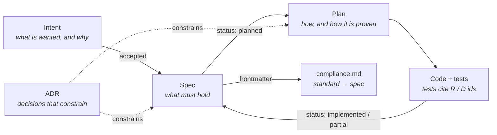
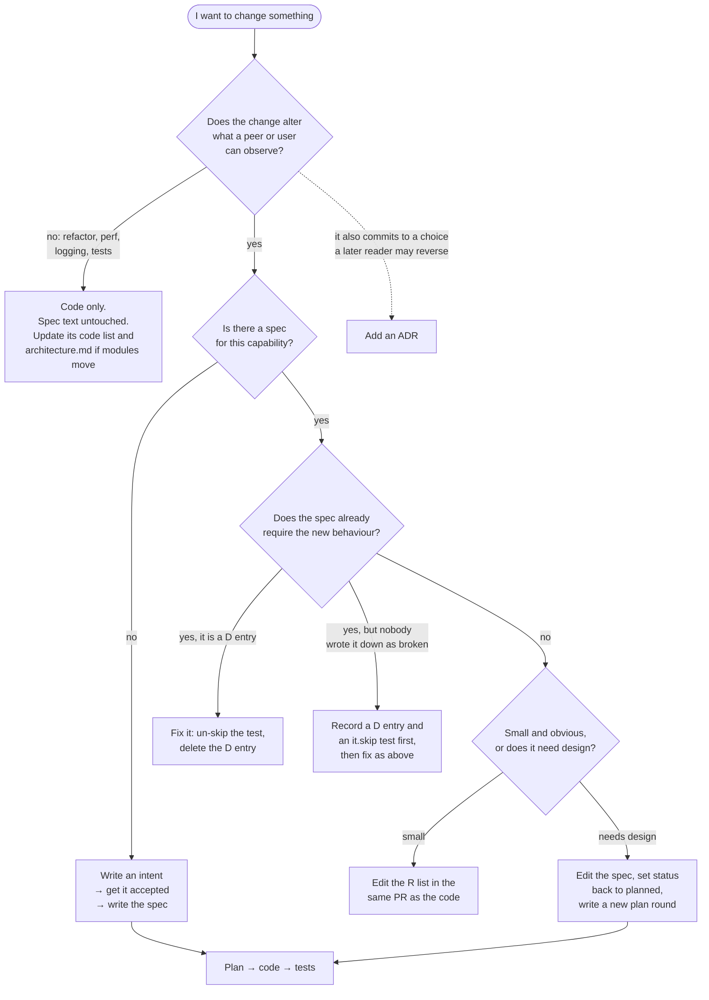
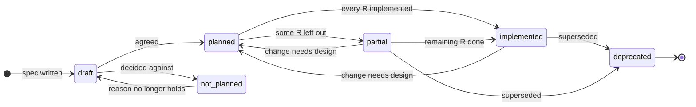
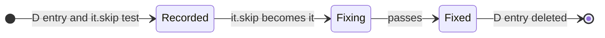
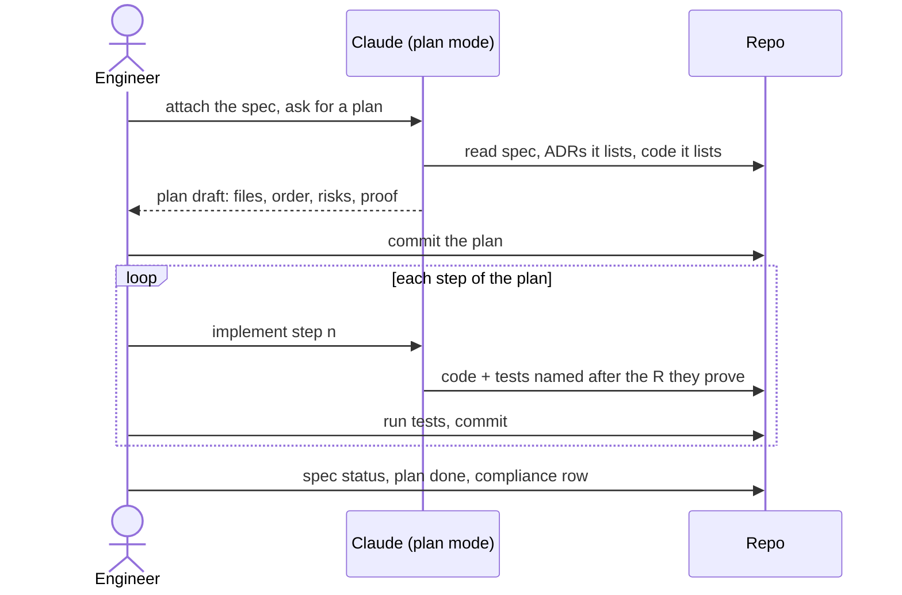

# How this package is developed

`@rocket.chat/xmpp-server` is developed spec-first. Every capability the package offers, or
is meant to offer, has a written spec in this folder. Work starts by writing or changing a
spec, continues with a plan derived from it, and ends with code whose tests cite the spec.
Decisions that constrain future work are recorded as ADRs. Nothing in this folder is
generated; it is the source the code is held against.

This differs from the rest of the repository, where features are described after the fact in
`docs/features/`. The root-level [docs/features/xmpp-server.md](../../../../docs/features/xmpp-server.md)
only points here.

## Why spec-first

XMPP federation is defined by standards that other servers implement independently. Whether
a stanza is right is decided by RFCs and XEPs and by what Prosody, ejabberd and Openfire
accept, not by what our code happens to do. Writing down what the package must do, in terms a
peer can observe, gives reviewers something to check the code against. It gives an engineer,
or Claude, the whole contract of a capability without reading the code first. It also keeps
the known gaps visible instead of leaving them in someone's memory.

The cost is that every behaviour change touches a spec. The rules below keep that cost small:
a spec changes in the same PR as the code, and a fix that matches the existing spec does not
touch it at all.

## The artifacts



| Artifact | Path | Answers | Named by | Changes after it is written? |
| --- | --- | --- | --- | --- |
| Intent | `intents/<slug>.md` | what is wanted and why | capability slug | status only |
| Spec | `specs/<slug>.md` | what the package must do, and where it falls short | capability slug | yes, it is a living document |
| Plan | `plans/<slug>.md` | how one round of work will be done and proven | the spec it implements, suffixed `-2`, `-3` for later rounds | status only |
| ADR | `adr/NNNN-<slug>.md` | why a design choice was made over its alternatives | sequence number | never; a new ADR supersedes it |
| Compliance matrix | `compliance.md` | which standard is covered by which spec | | whenever a spec's `standards` or `status` changes, or an intent names a standard |
| Architecture | `architecture.md` | where the code for each part lives | | whenever module boundaries move |
| Operations | `operations.md` | how to run it | | whenever a setting, port or environment variable changes |
| Templates | `templates/` | | | rarely |

A spec is one **capability**, not one standard. A capability may cover one XEP (ping) or
several (S2S connectivity covers RFC 6120, RFC 2782, XEP-0220 and XEP-0185), and a standard
may be split across capabilities (XEP-0045 is split between hosted and remote rooms). The
compliance matrix is the index from standard to spec.

## The loop

| Stage | Input | Output |
| --- | --- | --- |
| Plan | an idea, a ticket, a defect found in production | `intents/<slug>.md`, accepted |
| Design | an accepted intent | `specs/<slug>.md`, reviewed and moved to `planned` |
| Build | a planned spec | `plans/<slug>.md`, then code and tests |
| Test | the diff | proof for every requirement the plan lists |
| Merge | the PR, with spec status, plan status and compliance row already updated | merged into `develop` |
| Maintain | a defect report, a metric, a peer that misbehaves | a `D` entry in the spec, or a new intent |

There is no deploy stage. Merging is the last step; whatever is learned after that, from a
report, a metric or a peer, re-enters through Maintain. Unit and integration tests run in
CI. The end-to-end suite runs only on the engineer's machine, so the PR says it was run.

A defect is a gap between a spec and the code. It is written into the spec it violates as a
`D<n>` entry together with a skipped test that pins it. A fix un-skips the test and removes
the entry in the same PR.

A wanted capability that has no spec starts as an intent. An intent says what is wanted and
why; it does not say how. Once accepted, it becomes a spec, and the intent file stays as the
record of the motivation.

## Which path does my change take?

Start from what you have in hand. The most common paths are the shortest ones: a fix to a
known defect and a change that a spec already allows touch no spec text at all, apart from
deleting the `D` entry.



### A new capability

1. Write `intents/<slug>.md` from [templates/intent.md](templates/intent.md). Keep it about
   the problem: who is missing what, and how it shows. List the open questions; the intent is
   not accepted until they have answers.
2. Once accepted, write `specs/<slug>.md` from [templates/spec.md](templates/spec.md) with
   status `draft`. Fill in Summary, Motivation and Behaviour. Leave Design as "decided in
   the plan". Add the standards to the frontmatter and the matching rows to
   [compliance.md](compliance.md) in the same commit.
3. Get the spec reviewed. This is where the requirements are argued over, before code exists.
   When the review agrees, the status moves to `planned`.
4. Open Claude Code in plan mode with the spec attached and produce `plans/<slug>.md` from
   [templates/plan.md](templates/plan.md). Commit the plan by itself; that commit is the
   approval, there is no separate sign-off.
5. Implement in the order the plan gives, one commit per step. Each test names the
   requirement it proves.
6. In the PR, mark the plan `done`, fill in the spec's Design, `code` and `tests`, move its
   status to `implemented` or `partial`, and update the compliance row.

### Fixing a known defect

1. Find the `D` entry and its `it.skip` test (the test's comment links the anchor).
2. Change `it.skip` to `it`. Run it, against ejabberd for an end-to-end test, and watch it
   fail.
3. Fix the code until it passes.
4. Delete the `D` entry and the `// Known defect:` comment in the same commit as the fix.
   The `D` number is not reused.

No plan is needed when the fix is local. A fix that needs design, for example one that
changes the data model or crosses into Meteor, gets a plan round like any other work.

### A bug found in the field

1. Decide which spec it violates. If no requirement covers the expected behaviour, the bug
   is a missing requirement: add the `R` first.
2. Add a `### D<n> <heading>` entry under Known defects. Say what happens, the cause if
   known, and the test that pins it.
3. Write the test that shows the right behaviour: end-to-end against ejabberd, or in the
   integration suite when ejabberd cannot produce the trigger (a dropped S2S connection,
   for example). Mark it `it.skip` and put the link to the anchor in a comment above it.
4. Commit the entry and the test together, then fix as above, in the same PR or a later one.

### Changing the behaviour of an implemented capability

Edit the requirement in the same PR as the code. Never renumber: change the text of `R4` in
place, or strike it through and add a new `R` at the end when the meaning changes enough that
an old citation of `R4` would mislead. If the change reverses an ADR, write a new ADR that
supersedes it. If the change is large enough to need design, set the spec back to `planned`
and write a new plan round (`plans/<slug>-2.md`).

## Lifecycles



A spec, from first draft to retirement. `not_planned` is the `not-planned` status.



A defect. Recording it and fixing it can be separate PRs; un-skipping the test and deleting
the entry happen in the same commit as the fix.

## Statuses

Spec `status` in the frontmatter:

| Status | Meaning |
| --- | --- |
| `implemented` | every requirement is implemented; a `D` entry records where the implementation is wrong |
| `partial` | some requirements are deliberately left out; each is listed under Out of scope |
| `planned` | the spec is agreed and waits for a plan |
| `draft` | being written; not yet agreed |
| `not-planned` | the capability is deliberately absent; the reason is in Motivation |
| `deprecated` | superseded; the spec says by what |

Intent `Status`: `draft`, `accepted`, `rejected`. Plan `Status`: `approved`, `done`,
`abandoned`. ADR `Status`: `accepted`, or `superseded by NNNN`.

The compliance matrix has two statuses of its own: `intent`, for a standard an intent names
before any spec exists, and `draft`, mirroring a spec that is not yet agreed.

## Writing a spec

Requirements are the part of a spec everything else is held to. A good one:

- **Can be seen from outside the package**: a stanza on the wire, a document in the database,
  an error returned, an event emitted. "The router is refactored" is not a requirement.
- **Names the case**: who sends what, to whom, in which state. "Messages are delivered" is
  too broad. "A `groupchat` message from an occupant of a hosted room is stored in the
  Rocket.Chat room, authored by that occupant's user" can be tested.
- **Says MUST or SHOULD**: MUST for what the code is held to, SHOULD for what it does when
  nothing prevents it.
- **Cites the standard** with its section number when it implements one, so a reviewer can
  check the reading.

Everything a capability deliberately does not do goes under Out of scope, with the reason
when it is not obvious. That list is what turns a status into `partial` instead of
`implemented`, and it is what the compliance matrix's Notes column summarizes.

Design describes how the code meets the requirements, coarsely enough to survive a rename.
Mechanism that only matters inside one function belongs in the code, not here.

The frontmatter is read by people and by the compliance matrix:

```yaml
status: partial
standards: [XEP-0045]          # rows in compliance.md
adrs: [0006, 0008]             # decisions this capability depends on
code: [src/muc/MucRoom.ts]     # where it lives
tests: [tests/end-to-end/hosted-muc.spec.ts]
```

## When to write an ADR

Write one when a later reader could reasonably want to reverse the decision and would need to
know what it cost: the data model (ADR 0006), the trust model (ADR 0004, 0005), the process
model (ADR 0002, 0012), what is exposed (ADR 0008). Do not write one for the obvious way to do
something.

An ADR records a decision and the alternatives rejected. A spec records behaviour. When an
ADR and a spec disagree, the spec is out of date or the ADR needs superseding; fix whichever
one is wrong in the same PR. Once merged, an ADR is never edited: a later decision gets a new
number and marks the old one `superseded by NNNN`.

## Requirement and defect ids

Requirements are numbered `R1`, `R2`, … inside their spec and never renumbered. A removed
requirement keeps its number with the text struck through and a note. Defects are numbered
`D1`, `D2`, … the same way and are removed when fixed. Tests, plans, commits and PRs cite
them as `specs/hosted-muc.md R4` or `hosted-muc D1`.

Open questions, in intents and specs alike, are numbered `Q1`, `Q2`, … and never renumbered,
so a tracker issue or a review comment can cite `federation-authorization Q2`. An answered
question keeps its number with the text struck through and a pointer to where the answer
went: a requirement, a constraint, or an ADR.

Every `D` heading is an anchor. The skipped test that pins the defect, end-to-end or
integration, carries a comment with the relative path and the anchor, for example
`// Known defect: ../../docs/specs/hosted-muc.md#d1-kicked-xmpp-users-are-not-told-they-were-removed`.

Where each id shows up:

| Where | Form | Example |
| --- | --- | --- |
| Test name, same spec as the test file | `(R<n>)` at the end | `'mirrors the room in Rocket.Chat when a local user is invited (R1)'` |
| Test name, another spec | `(<slug> R<n>)` | `'applies a correction from the XMPP user to the stored message (message-corrections R4)'` |
| Skipped test | comment above it | `// Known defect: ../../docs/specs/presence.md#d1-presence-from-xmpp-users-is-ignored` |
| Plan, Proof section | one table row per `R` | `R3` → the test file and test name that prove it |
| Commit body | `<slug> R<n>` / `<slug> D<n>` | `hosted-muc D3: a topic changed in Rocket.Chat reaches only whoever joins next` |

## What must move together

- Behaviour changes and the spec that describes it ship in the same PR.
- A standard added to or removed from a spec's `standards` list updates `compliance.md` in
  the same commit. The matrix is never edited on its own.
- A decision that a later reader could reasonably want to reverse gets an ADR. A decision
  that is just the obvious way to do it does not.
- A plan is committed before the code it describes, and marked `done` in the PR that ships it.
- A `D` entry is deleted in the same commit that un-skips its test.
- A user-visible change also adds a `.changeset` entry, as anywhere in the repo. Refactors
  and spec-only edits do not.

## Working with Claude

The package-level [CLAUDE.md](../CLAUDE.md) tells Claude the same rules in the form it reads
at the start of a session, so a session opened in this package already knows them.

Three skills, listed when Claude Code runs inside this package, drive the authoring stages:

- `/xmpp-intent <problem>` interviews you and writes `intents/<slug>.md`.
- `/xmpp-spec <intent or draft spec>` writes a spec from an accepted intent, or reviews a
  draft against the rules in "Writing a spec".
- `/xmpp-plan <planned spec>` produces `plans/<slug>.md` in plan mode.

[examples.md](examples.md) shows each one with the prompt to type, what comes back, what to
check, and which model to run it with.



- Attach the spec, not a summary of it. The spec is the contract; a paraphrase loses the
  numbering the tests cite.
- Review the plan's Proof table before any code exists. A requirement with no test in that
  table will not be proven.
- When Claude proposes behaviour the spec does not have, decide whether it belongs in the
  spec. Either add the `R` or drop the code.
- Claude edits specs too. Read every spec diff as carefully as a code diff: it changes what
  the code is held to.

## Reviewing a PR in this package

- Every behaviour change has a matching spec change in the same diff, and every spec change
  has the code that makes it true, or a `D` entry that says it is not true yet.
- New and changed tests name the `R` they prove. A fixed defect's test is a plain `it`, and
  its `D` entry is gone.
- Spec status, plan status and compliance rows agree with each other.
- A choice someone could want to reverse has an ADR, and no merged ADR was edited.
- Comments state intent; reasoning lives in the spec or an ADR.
