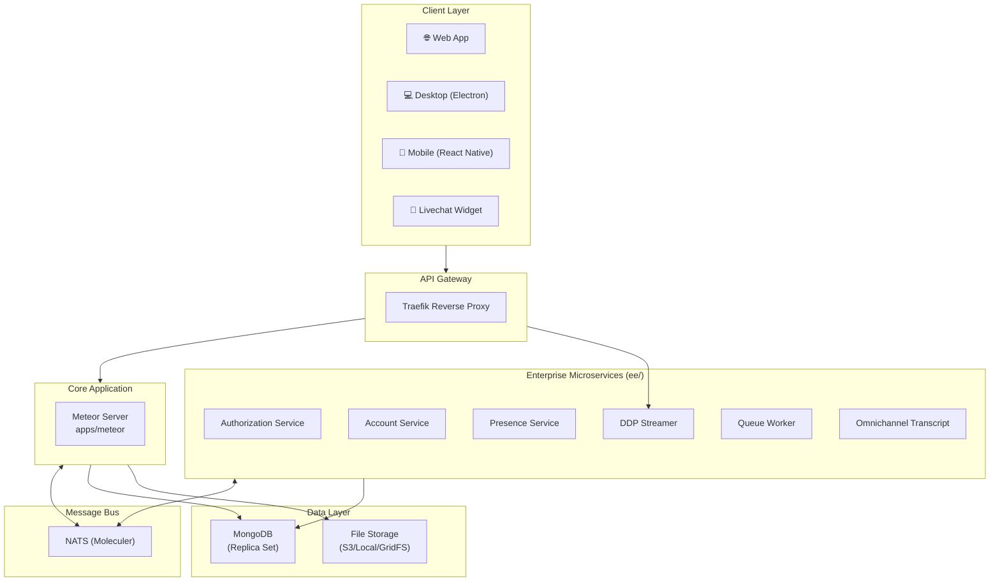
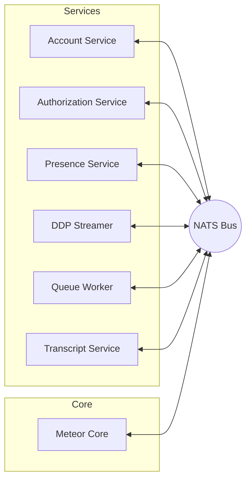
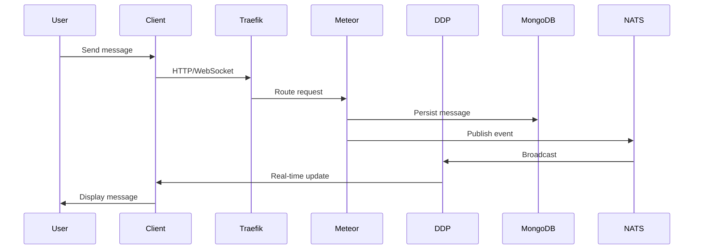
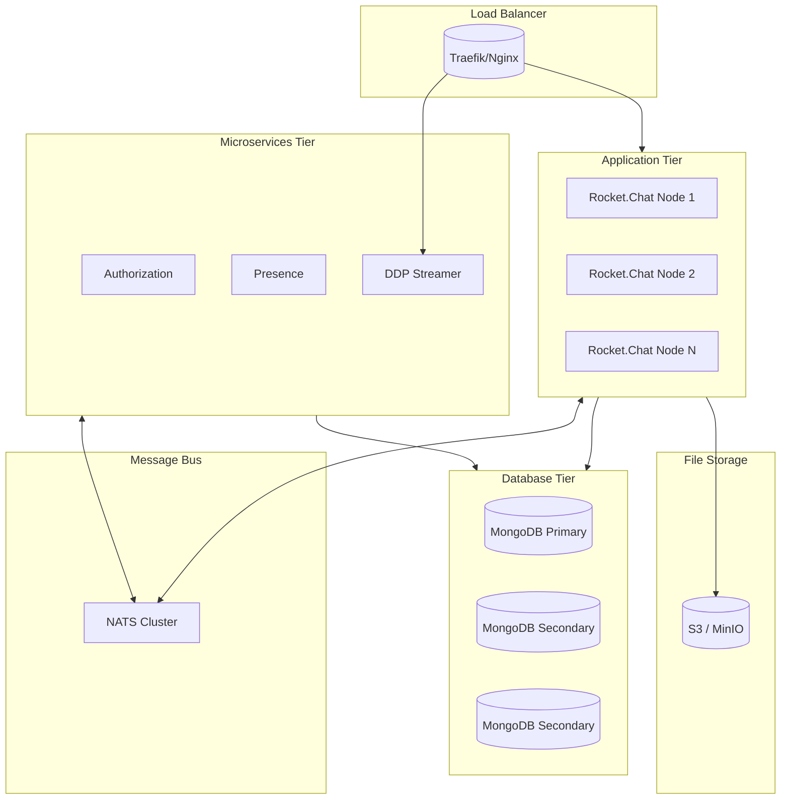

# Rocket.Chat Architecture Report

> **Version:** 8.1.0-develop | **Node:** 22.16.0 | **Yarn:** 4.12.0

---

## System Architecture



---

## Technology Stack

| Layer | Technology |
|-------|------------|
| Runtime | Node.js 22.16.0 |
| Framework | Meteor.js |
| Language | TypeScript 5.9.3 |
| Database | MongoDB 6.10 (Replica Set) |
| Message Broker | NATS + Moleculer |
| Build System | Turborepo |
| UI | React + Fuselage |

---

## Monorepo Structure

```
Rocket.Chat/
├── apps/
│   ├── meteor/          # Core server (97 feature modules)
│   └── uikit-playground/
├── packages/            # 55 shared packages
│   ├── core-services/
│   ├── core-typings/
│   ├── apps-engine/
│   ├── livechat/
│   └── ui-*/
└── ee/                  # Enterprise Edition
    ├── apps/            # Microservices
    └── packages/        # License, federation, etc.
```

---

## Enterprise Microservices



| Service | Purpose |
|---------|---------|
| authorization-service | Permission checks (ABAC) |
| account-service | User operations at scale |
| presence-service | Online/offline status |
| ddp-streamer | WebSocket scaling |
| queue-worker | Background jobs |
| omnichannel-transcript | PDF generation |

---

## Data Flow



---

## Production Deployment



---

## Core Feature Modules (`apps/meteor/app/`)

| Category | Modules |
|----------|---------|
| **Communication** | livechat, threads, reactions, mentions, e2e |
| **Auth** | 2fa, authentication, authorization, meteor-accounts-saml, custom-oauth |
| **Integrations** | apps, integrations, slackbridge, irc, importer-slack |
| **Providers** | apple, GitHub, GitLab, google-oauth, ldap |

---

## Development Commands

| Command | Description |
|---------|-------------|
| `yarn dev` | Start dev server |
| `yarn build` | Production build |
| `yarn lint` | Run ESLint |
| `yarn testunit` | Run unit tests |
