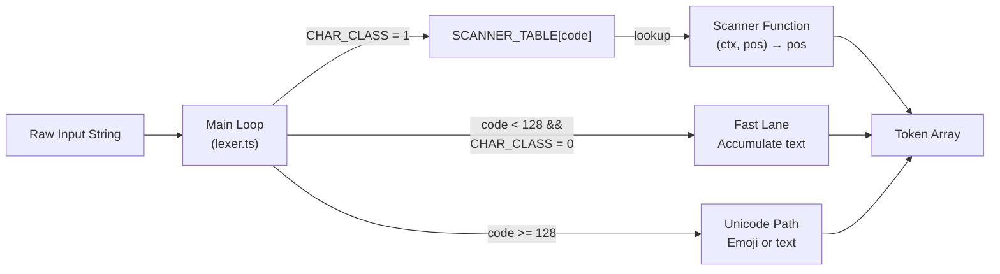

# Handwritten Message Parser Prototype for Rocket.Chat

A prototype implementation of a handwritten message parser for [Rocket.Chat](https://rocket.chat).

## Motivation

This repository currently implements the **lexer stage prototype** of the proposed handwritten parser architecture.
The parser stage will be implemented on top of this token stream.

This project explores a **handwritten lexer → parser pipeline** designed to:

- reduce parsing overhead
- avoid regex-heavy backtracking
- provide deterministic tokenization
- improve performance and maintainability

The first stage implemented here is the **lexer**, which converts raw input
into a stream of tokens that will later be consumed by a handwritten parser.

## Performance

Benchmarks comparing the handwritten lexer with the current parser:

| Input | Current Parser | Handwritten Lexer |
|------|---------------|------------------|
| Short text | ~12k ops/sec | ~7.8M ops/sec |
| Medium text | ~2.8k ops/sec | ~816k ops/sec |
| Long text | ~234 ops/sec | ~64k ops/sec |

The handwritten lexer performs a single deterministic pass over the input
using direct character classification and scanner dispatch tables.
This avoids the backtracking and repeated pattern matching present in the
current PEG-based parser.

The final handwritten parser will introduce additional overhead due to
AST construction and structural parsing. However, because the lexer
already performs the expensive character scanning work, the parser
will operate on a pre-tokenized stream and avoid repeated string
processing.

## How It Works

The lexer takes a raw input string like:

```
# Hello **world** :smile: @john
```

and produces a **flat array of tokens**:

```
HEADING_MARKER("1") → WS(" ") → TEXT("Hello") → WS(" ") → ASTERISK("**") →
TEXT("world") → ASTERISK("**") → WS(" ") → EMOJI_SHORTCODE("smile") →
WS(" ") → MENTION_USER("john") → EOF
```

The parser (stage 2) will later consume this stream and build a nested AST. The lexer intentionally makes **no nesting decisions** — it doesn't know whether `**` opens or closes a bold span. That's the parser's job.

## Architecture Overview



The design has three layers:

| Layer | File(s) | Responsibility |
|---|---|---|
| **Orchestrator** | `lexer.ts` | Main loop, fast-lane text, dispatch |
| **Scanners** | `scanners/*.ts` | One function per character type |
| **Helpers** | `ScanContext.ts`, `helpers.ts` | Shared utilities (emit, flush, trie match) |

## Next Steps

The next stage of this project is implementing the handwritten parser that
consumes the token stream produced by the lexer.

Planned work includes:

- recursive-descent parser implementation
- AST construction
- nested formatting resolution
- improved error recovery
- full parser performance benchmarking