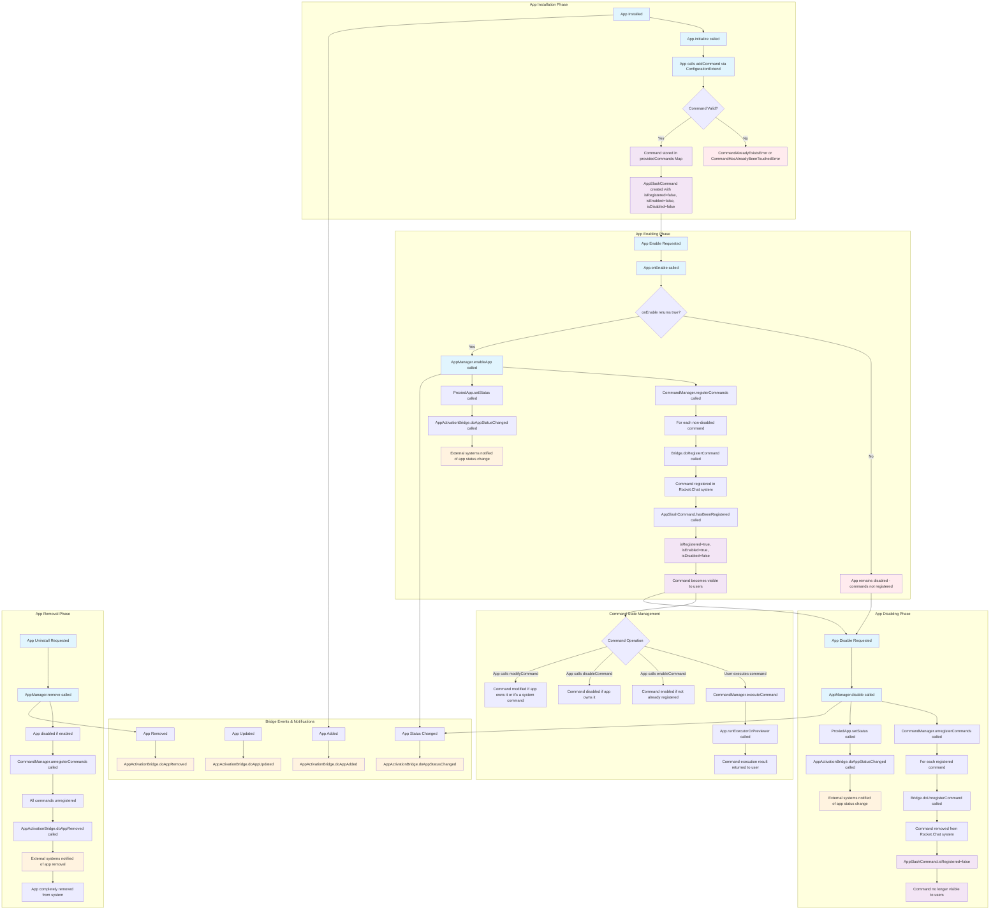

# Slash Command Lifecycle in Rocket.Chat Apps Engine

This flowchart documents the possible transitions and states of slash commands registered by Rocket.Chat apps, based on analysis of the `packages/apps-engine` codebase.

## Mermaid Flowchart

## Key Findings

### 1. When are slash commands registered in Rocket.Chat?

Slash commands become visible to users through this sequence:

1. **App Installation**: Commands are added during `App.initialize()` via `ConfigurationExtend.slashCommands.provideSlashCommand()`
2. **Storage Phase**: Commands are stored in `AppSlashCommandManager.providedCommands` but **NOT yet registered** in the Rocket.Chat system
3. **App Enabling**: When `App.onEnable()` returns `true`, `AppManager.enableApp()` calls `CommandManager.registerCommands()`
4. **Bridge Registration**: `CommandBridge.doRegisterCommand()` is called for each non-disabled command
5. **Visibility**: Only after successful bridge registration do commands become visible and executable by users

**Critical Point**: Commands are **NOT** visible to users immediately upon installation. They only become visible after the app is successfully enabled and the bridge registration completes.

### 2. Bridge Activation Events

The apps engine triggers these notifications through `AppActivationBridge`:

| App Lifecycle Event | Bridge Method Called | When It Occurs |
|-------------------|---------------------|----------------|
| App Installation | `doAppAdded(app)` | After app is installed and stored |
| App Update | `doAppUpdated(app)` | After app is updated |
| App Status Change | `doAppStatusChanged(app, status)` | When app is enabled/disabled/status changes |
| App Removal | `doAppRemoved(app)` | When app is uninstalled |

**Note**: The apps-engine framework does **NOT** have specific `command/added` or `command/removed` events. Instead, command lifecycle is tied to app lifecycle events through the `AppActivationBridge`.

### 3. Command States

Each `AppSlashCommand` has three key states:

- **`isRegistered`**: Whether the command is registered in the Rocket.Chat system
- **`isEnabled`**: Whether the command is enabled (can be set even if not registered)
- **`isDisabled`**: Whether the command is disabled (can be set even if not registered)

State transitions:
- **Initial**: `isRegistered=false, isEnabled=false, isDisabled=false`
- **After successful registration**: `isRegistered=true, isEnabled=true, isDisabled=false`
- **After unregistration**: `isRegistered=false` (other states may persist)

### 4. Command Ownership and Touch Rules

- Apps can only modify commands they "own" or system commands not touched by other apps
- First app to touch a command gets exclusive control
- Commands can be provided, modified, enabled, or disabled by the owning app
- Modified system commands are tracked separately from provided commands