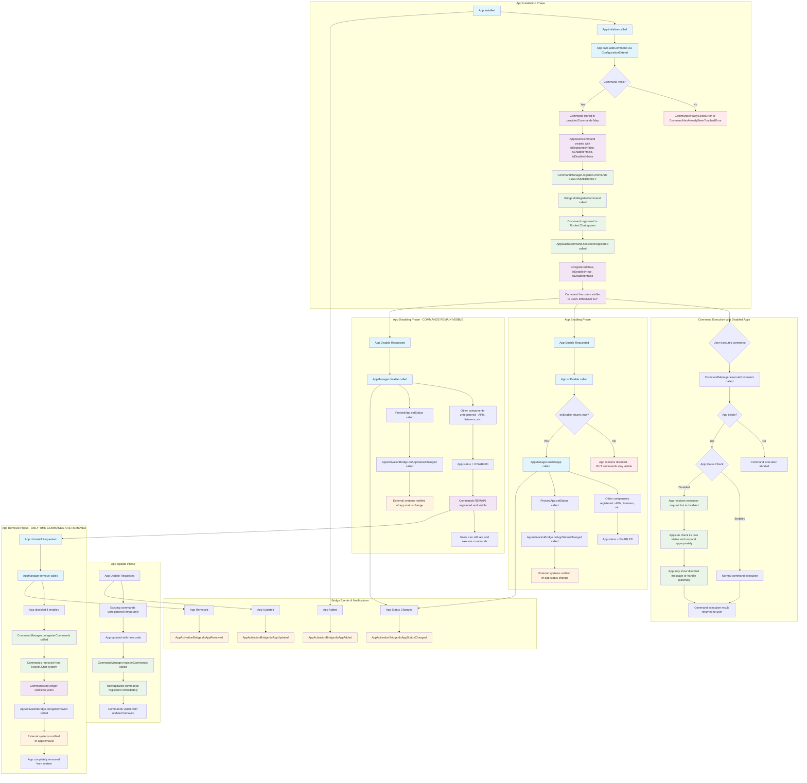

# Updated Slash Command Lifecycle in Rocket.Chat Apps Engine

This flowchart documents the **modified** behavior of slash commands registered by Rocket.Chat apps, where commands become visible immediately upon installation and remain visible even when apps are disabled.

## Key Changes Made

1. **Commands register during installation** - not during app enabling
2. **Commands remain visible when apps are disabled** - they don't get unregistered
3. **Commands are only removed during app uninstallation**
4. **Disabled apps can still execute commands** - they should handle their disabled state gracefully

## Modified Mermaid Flowchart

## Summary of Changes Made

### 1. Modified Files and Methods

#### AppManager.ts
- **`add()` method**: Added `await this.commandManager.registerCommands(app.getID());` after installation
- **`purgeAppConfig()` method**: Commented out `await this.commandManager.unregisterCommands(app.getID());`
- **`enableApp()` method**: Commented out command registration (now happens during installation)
- **`removeLocal()` method**: Added explicit command unregistration during app removal
- **`updateAndStartupLocal()` and `updateAndInitializeLocal()` methods**: Added command registration after updates

#### AppSlashCommandManager.ts
- **`executeCommand()` method**: Removed app disabled check - now allows execution for disabled apps
- **`getPreviews()` method**: Removed app disabled check - now allows preview generation for disabled apps
- **`executePreview()` method**: Removed app disabled check - now allows preview execution for disabled apps
- **`shouldCommandFunctionsRun()` method**: Updated comments to clarify that this checks command-level disable, not app status disable

### 2. New Behavior Summary

| Event | Old Behavior | New Behavior |
|-------|-------------|-------------|
| **App Installation** | Commands stored but not visible | Commands immediately registered and visible |
| **App Enabling** | Commands registered and become visible | Commands already visible, only other components registered |
| **App Disabling** | Commands unregistered and hidden | Commands remain visible and executable |
| **App Execution (Disabled)** | Commands not executable | Commands executable, app handles disabled state |
| **App Uninstallation** | Commands unregistered | Commands unregistered (only time they're removed) |

### 3. Benefits of New Approach

1. **Better User Experience**: Commands are immediately available after app installation
2. **Consistency**: Commands remain available even if app is temporarily disabled
3. **Graceful Degradation**: Apps can handle their disabled state and inform users appropriately
4. **Simpler State Management**: Commands lifecycle is decoupled from app enable/disable lifecycle

### 4. App Developer Considerations

Apps should now:
- Check their own status when commands are executed
- Provide appropriate feedback when disabled (e.g., "This app is currently disabled")
- Handle graceful degradation in their command handlers
- Be aware that commands remain visible even when the app is disabled

The modified implementation provides a more user-friendly experience where slash commands remain consistently available while still allowing apps to handle their disabled state appropriately.